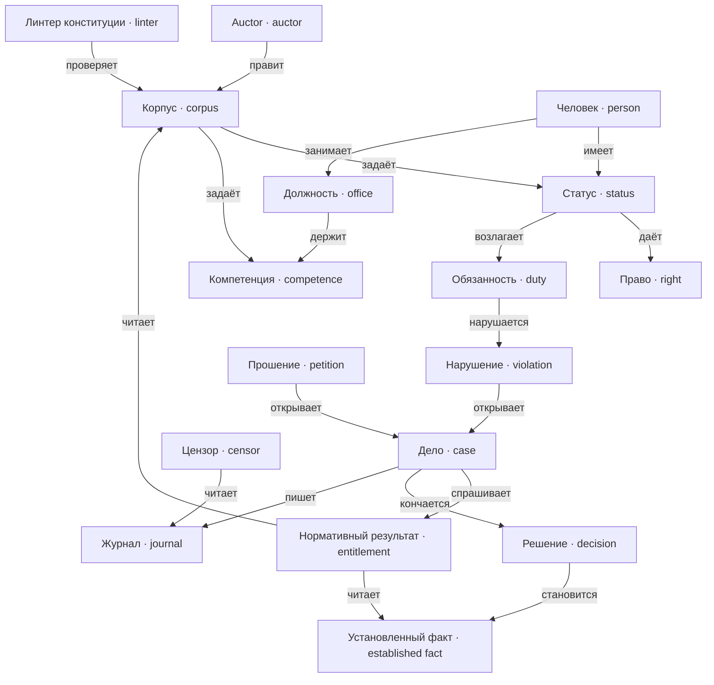

---
tags:
  - карта
---

# Реестр понятий

Справочник, а не чтение подряд. Целое читается в
[[docs/guide/01-what-it-is|guide]]; сюда ходят за точным значением термина и за
тем, с чем он связан.

## Как устроено

Понятия собраны **по областям**: одна область — один документ, термины внутри —
дерево заголовков. Документ области открывается абзацем и схемой связей, дальше
идут термины:

- `##` — самостоятельная сущность области;
- `###` — её вид, часть или свойство, которое стоит отличать отдельно.

Ссылка на термин ведёт на заголовок: `[[docs/concepts/law#Норма|норма]]`. Путь
от корня хранилища, после `#` — текст заголовка ровно как в документе.
Английское имя в обратных кавычках под заголовком — кандидат для идентификатора
в коде.

Правило добавления: термин появляется, когда его надо отличать от соседнего. Если
в определении нечего написать в графе «не путать с» — термин, скорее всего,
лишний. Новый термин получает заголовок в своей области и строку в указателе
ниже; `scripts/check-docs.sh` проверяет и то и другое.

## Области

- [[docs/concepts/game|Игра]] — кто играет и в каком ритме: auctor, полития,
  период;
- [[docs/concepts/people|Люди]] — человек, статус, права и обязанности;
- [[docs/concepts/institutions|Институты]] — должность, компетенция, допуск,
  actor;
- [[docs/concepts/law|Закон]] — корпус, документ, норма, правило вывода,
  вытеснение;
- [[docs/concepts/cases|Дела и факты]] — утверждение и факт, прошение и
  нарушение, дело и путь решения;
- [[docs/concepts/derivation|Вывод]] — нормативный результат, трасса, пересчёт
  затронутых;
- [[docs/concepts/observation|Наблюдение]] — провалы, линтер, граф власти,
  журнал, цензор, отчёт;
- [[docs/concepts/architecture|Архитектурные]] — команда и доменное событие.

## Как области связаны

## Указатель

### Игра

| Термин | Одной строкой |
| --- | --- |
| [[docs/concepts/game#Auctor\|Auctor]] | Игрок: учредительная власть вне политии |
| [[docs/concepts/game#Кодификация\|Кодификация]] (`Codification`) | Акт auctor, которым практика становится нормой |
| [[docs/concepts/game#Событие мира\|Событие мира]] (`WorldEvent`) | Внешнее обстоятельство, вбрасываемое auctor |
| [[docs/concepts/game#Полития\|Полития]] (`Polity`) | Вымышленное государство: люди, статусы, институты, корпус |
| [[docs/concepts/game#Период\|Период]] (`Period`) | Единица времени мира и цикл взаимодействия одновременно |
| [[docs/concepts/game#Фаза\|Фаза]] (`Phase`) | Часть периода: правка → проживание → отчёт |

### Люди

| Термин | Одной строкой |
| --- | --- |
| [[docs/concepts/people#Человек\|Человек]] (`Person`) | Симулируемый субъект: факты, должности, прошения, желания |
| [[docs/concepts/people#Желание\|Желание]] (`Desire`) | Внутренняя цель, влияет на поведение, но не на право |
| [[docs/concepts/people#Знание норм\|Знание норм]] (`Knowledge`) | Какие нормы попали в контекст человека; данные, не способность |
| [[docs/concepts/people#Статус\|Статус]] (`Status`) | Именованный пучок прав и обязанностей; наследуемость — его свойство |
| [[docs/concepts/people#Пучок прав\|Пучок прав]] (`RightBundle`) | Подмножество прав, которое даёт статус; у него есть двойник из обязанностей |
| [[docs/concepts/people#Право\|Право]] (`Right`) | Возможность, защищённая нормой; выводится, не хранится |
| [[docs/concepts/people#Обязанность\|Обязанность]] (`Duty`) | Требование нормы: носитель, адресат, условие, срок, вид |
| [[docs/concepts/people#Вид обязанности\|Вид обязанности]] (`DutyKind`) | Достижение однажды до срока или состояние всё время |
| [[docs/concepts/people#Разрешение\|Разрешение]] (`Permission`) | Правило, снимающее обязанность или запрет |

### Институты

| Термин | Одной строкой |
| --- | --- |
| [[docs/concepts/institutions#Институт\|Институт]] (`Institution`) | Орган, состоящий из должностей |
| [[docs/concepts/institutions#Должность\|Должность]] (`Office`) | Замещаемое место, к которому привязана компетенция |
| [[docs/concepts/institutions#Способ замещения\|Способ замещения]] (`SuccessionMethod`) | Объявленный порядок получения должностью человека |
| [[docs/concepts/institutions#Способность проверять\|Способность проверять]] (`EnforcementCapacity`) | Сколько проверок успевает должность; поводы приходят и от частного интереса |
| [[docs/concepts/institutions#Допуск\|Допуск]] (`Eligibility`) | Может ли человек занять должность; выводится из статуса и цензов |
| [[docs/concepts/institutions#Компетенция\|Компетенция]] (`Competence`) | Что должности позволено совершать |
| [[docs/concepts/institutions#Действие вне компетенции\|Действие вне компетенции]] (`UltraVires`) | Действие, тип которого должности не позволен |
| [[docs/concepts/institutions#Actor\|Actor]] | Тот, кто совершает действие от имени должности |

### Закон

| Термин | Одной строкой |
| --- | --- |
| [[docs/concepts/law#Корпус\|Корпус]] (`Corpus`) | Всё действующее на период; версионируется целиком |
| [[docs/concepts/law#Нормативный документ\|Нормативный документ]] (`NormativeDocument`) | Версионируемый источник норм с уровнем в иерархии |
| [[docs/concepts/law#Конституция\|Конституция]] (`Constitution`) | Высший документ; изменяема по объявленной в ней процедуре |
| [[docs/concepts/law#Кодекс\|Кодекс]] (`Code`) | Документ уровнем ниже конституции |
| [[docs/concepts/law#Приоритет документов\|Приоритет документов]] (`DocumentPriority`) | Какая из противоречащих норм побеждает |
| [[docs/concepts/law#Норма\|Норма]] (`Norm`) | Адресуемое правило внутри документа; хранится структурно |
| [[docs/concepts/law#Вид нормы\|Вид нормы]] (`NormKind`) | Конститутивная или длящаяся — судьба основания |
| [[docs/concepts/law#Ретроактивность\|Ретроактивность]] (`Retroactivity`) | Принята в N, действует с M, где `M < N` |
| [[docs/concepts/law#Защита приобретённого\|Защита приобретённого]] (`VestedProtection`) | Норма корпуса, а не свойство движка |
| [[docs/concepts/law#Правило вывода\|Правило вывода]] (`InferenceRule`) | Структурная форма нормы |
| [[docs/concepts/law#Вытеснение\|Вытеснение]] (`Defeat`) | Одно правило побеждает другое; так выражается исключение |
| [[docs/concepts/law#Ограничение целостности\|Ограничение целостности]] (`IntegrityConstraint`) | Комбинация выводов, объявленная недопустимой |
| [[docs/concepts/law#Усмотрение\|Усмотрение]] (`Discretion`) | Пространство, которое норма оставляет должности |

### Дела и факты

| Термин | Одной строкой |
| --- | --- |
| [[docs/concepts/cases#Утверждение\|Утверждение]] (`Claim`) | Высказывание участника; истинность не предполагается |
| [[docs/concepts/cases#Установленный факт\|Установленный факт]] (`EstablishedFact`) | Утверждение, принятое процедурой; неизменен |
| [[docs/concepts/cases#Провенанс\|Провенанс]] (`Provenance`) | Кто, от имени какой должности, в каком периоде, на каком основании |
| [[docs/concepts/cases#Прошение\|Прошение]] (`Petition`) | Требование человека рассмотреть исход |
| [[docs/concepts/cases#Нарушение\|Нарушение]] (`Violation`) | Вывод о том, что обязанность не исполнена; повод, не приговор |
| [[docs/concepts/cases#Последствие нарушения\|Последствие нарушения]] (`Reparation`) | Вторичная обязанность из нарушения, установленного вступившим в силу решением; срок — от вступления в силу |
| [[docs/concepts/cases#Запись о проступке\|Запись о проступке]] (`AdjudicatedOffense`) | Последствие вступившего в силу решения о нарушении |
| [[docs/concepts/cases#Дело\|Дело]] (`Case`) | Рамка рассмотрения прошения или спора |
| [[docs/concepts/cases#Решение\|Решение]] (`Decision`) | Исход, вынесенный компетентной должностью; факт навсегда |
| [[docs/concepts/cases#Intercessio\|Intercessio]] | Приостановление решения до вступления в силу |
| [[docs/concepts/cases#Пересмотр\|Пересмотр]] (`Review`) | Проверка решения другой должностью |
| [[docs/concepts/cases#Вступление в силу\|Вступление в силу]] (`Finalization`) | Переход, после которого решение исполнимо |
| [[docs/concepts/cases#Исполнение\|Исполнение]] (`Execution`) | Применение решения владельцем состояния |

### Вывод

| Термин | Одной строкой |
| --- | --- |
| [[docs/concepts/derivation#Нормативный результат\|Нормативный результат]] (`Entitlement`) | Единственный ответчик: что применимо к случаю в периоде |
| [[docs/concepts/derivation#Трасса вывода\|Трасса вывода]] (`DerivationTrace`) | Почему у этого человека есть это право |
| [[docs/concepts/derivation#Non liquet\|Non liquet]] (`NonLiquet`) | Исход «не ясно»: корпус не даёт по делу определённого ответа — пробел, тупик без порядка или блокировка защитой |
| [[docs/concepts/derivation#Пересчёт затронутых\|Пересчёт затронутых]] (`Impact`) | Разница состояний между двумя версиями корпуса |

### Наблюдение

| Термин | Одной строкой |
| --- | --- |
| [[docs/concepts/observation#Провал конструкции\|Провал конструкции]] (`ConstructionFailure`) | Наблюдаемый дефект корпуса или практики; приз партии |
| [[docs/concepts/observation#Линтер конституции\|Линтер конституции]] (`Linter`) | Детерминированная проверка корпуса до хода |
| [[docs/concepts/observation#Граф власти\|Граф власти]] (`PowerGraph`) | Должности и связи между ними; строится на период, не хранится |
| [[docs/concepts/observation#Отчёт периода\|Отчёт периода]] (`Report`) | Что произошло, что нашёл линтер, кого задело |
| [[docs/concepts/observation#Журнал\|Журнал]] (`Journal`) | Запись всего произошедшего с провенансом |
| [[docs/concepts/observation#Цензор\|Цензор]] (`Censor`) | Аналитика поверх журнала; решать не вправе |

### Архитектурные

| Термин | Одной строкой |
| --- | --- |
| [[docs/concepts/architecture#Доменное событие\|Доменное событие]] (`DomainEvent`) | Типизированный факт в прошедшем времени, без транспорта |
| [[docs/concepts/architecture#Команда\|Команда]] (`Command`) | Намерение изменить состояние; может быть отклонено |

## Пока не определено

- какие статусы существуют в стартовой конституции и сколько прав в пучке;
- что является доказательством и какая должность устанавливает факт в общем
  случае;
- является ли дело агрегатом или координацией нескольких владельцев;
- как называются вымышленные институты в коде и UI.
