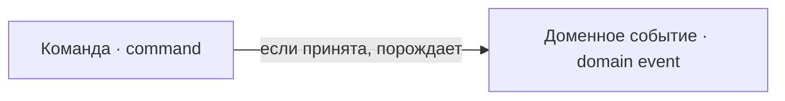

---
tags:
  - понятие
---

# Архитектурные

Не язык предметной области, а язык устройства: как намерение изменить состояние отличается от случившегося факта.

## Доменное событие

`DomainEvent`

Неизменяемый типизированный факт в прошедшем времени, порождённый владельцем
модели. Не содержит метаданных брокера и не сериализует себя: транспорт выбирает
адаптер.

**Не путать с** сообщением конкретного брокера и с
[[docs/concepts/game#Событие мира|событием мира]].

## Команда

`Command`

Адресованное владельцу модели намерение изменить состояние. Может быть
отклонена — в частности как [[docs/concepts/institutions#Действие вне компетенции|действие вне
компетенции]].

**Не путать с** [[docs/concepts/cases#Прошение|прошением]] человека и с
[[docs/concepts/architecture#Доменное событие|доменным событием]].
