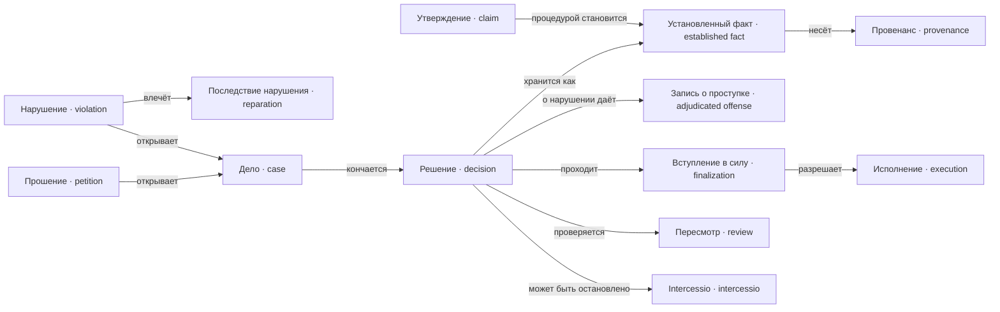

---
tags:
  - понятие
---

# Дела и факты

Утверждение становится установленным фактом только процедурой, и факт несёт провенанс. Дело открывается прошением или выведенным нарушением и кончается решением, которое проходит intercessio, пересмотр, вступление в силу и исполнение — и само становится фактом. Нарушение становится проступком и влечёт последствие только вступившим в силу решением.

## Утверждение

`Claim`

Проверяемое высказывание участника о факте или норме. Истинность не
предполагается.

Утверждение становится [[docs/concepts/cases#Установленный факт|установленным фактом]]
только надлежащей процедурой. Текст языковой модели всегда является
утверждением.

**Не путать с** установленным фактом.

## Установленный факт

`EstablishedFact`

[[docs/concepts/cases#Утверждение|Утверждение]], принятое компетентной должностью по
надлежащей процедуре, с [[docs/concepts/cases#Провенанс|провенансом]]: что, кем и в
каком периоде установлено.

Факты неизменны и образуют экстенсиональную базу вывода. «Орган Y решил X в
периоде N» — факт, он не пересчитывается никогда; какие права даёт это решение
— [[docs/concepts/derivation#Нормативный результат|вывод]], он пересчитывается сам.

Модельная привычка: интервалы вместо перечислений. Служба хранится одним
интервалом, а не фактом на каждый период, иначе в вычислитель протащится
агрегация.

**Не путать с** текстом модели, слухом и внешним вводом.

### Провенанс

`Provenance`

Обязательные поля всякого хранимого факта: кто установил, от имени какой
[[docs/concepts/institutions#Должность|должности]], в каком [[docs/concepts/game#Период|периоде]], на
каком основании, с каким correlation ID.

Провенанс пишется с самого начала, даже пока [[docs/concepts/observation#Цензор|цензора]]
нет: без него отложенную аналитику потом не на чем построить.

## Прошение

`Petition`

Зарегистрированное требование человека рассмотреть определённый исход. Подача
зависит от [[docs/concepts/people#Желание|желания]] и
[[docs/concepts/people#Знание норм|знания норм]], а не от того, есть ли у человека право.

Прошение порождает [[docs/concepts/cases#Дело|дело]] и не подтверждает содержащихся в
нём утверждений.

**Не путать с** установленным фактом, [[docs/concepts/architecture#Команда|командой]] и
решением.

## Нарушение

`Violation`

Вывод о том, что [[docs/concepts/people#Обязанность|обязанность]] не исполнена: срок
достижения истёк либо состояние не выполнялось в периоде.

**Выводится, а не вносится.** Это отличает нарушение от
[[docs/concepts/cases#Запись о проступке|записи о проступке]]: движок выводит, что
долг не исполнен, но проступком это становится только вступившим в силу
решением компетентной должности.

Порядок жёсткий: нарушение является поводом для [[docs/concepts/cases#Дело|дела]], а
не приговором. Иначе обвинение хранилось бы как совершённое преступление.

Нарушение, установленное вступившим в силу решением, может повлечь
[[docs/concepts/cases#Последствие нарушения|вторичную обязанность]].
Обязанность, нарушение которой не влечёт ничего, является
[[docs/concepts/observation#Провал конструкции|провалом конструкции]]: соблюдать её
незачем.

### Последствие нарушения

`Reparation`

Вторичная [[docs/concepts/people#Обязанность|обязанность]], возникающая из
[[docs/concepts/cases#Нарушение|нарушения]] первичной: возместить, уплатить, явиться,
претерпеть.

Возникает из нарушения, установленного вступившим в силу решением, и **срок её
считается от вступления решения в силу**. Выведенное нарушение не помнит периода:
от него срок сползал бы каждый период, и последствие не нарушалось бы никогда.

Последствия образуют цепочку: нарушение вторичной обязанности может влечь
третью. Цепочка конечна и объявлена нормой; её последнее звено — то, чем
исчерпывается требование.

Именно последствие делает обязанность обязанностью. Норма, которую можно
нарушить без единого следствия, отличается от рекомендации только тоном.

### Запись о проступке

`AdjudicatedOffense`

Последствие вступившего в силу [[docs/concepts/cases#Решение|решения]] об
установленном нарушении. Хранится как факт с
[[docs/concepts/cases#Провенанс|провенансом]] и не пересчитывается.

Это конец цепочки, а не её начало: [[docs/concepts/cases#Нарушение|нарушение]]
выводится движком → становится поводом для [[docs/concepts/cases#Дело|дела]] →
компетентная должность выносит решение → решение вступает в силу → появляется
запись о проступке.

**Не путать с** нарушением, обвинением, подозрением и тем более со скрытой
оценкой человека. Ни один шаг цепочки нельзя пропустить: выведенное движком
нарушение проступком само по себе не является.

## Дело

`Case`

Рамка рассмотрения [[docs/concepts/cases#Прошение|прошения]] или спора: участники,
подлежащий проверке вопрос, установленные по нему факты,
[[docs/concepts/cases#Решение|решение]], возможная
[[docs/concepts/cases#Intercessio|intercessio]] и
[[docs/concepts/cases#Исполнение|исполнение]].

Дело может жить дольше одного [[docs/concepts/game#Период|периода]] и имеет
объявленный предельный срок, по истечении которого прекращается само. Пока дело
не завершено, оно идёт по **действующему** корпусу, а не по замороженному на
момент подачи.

**Не путать с** человеком и с окончательным решением.

## Решение

`Decision`

Формальный исход, вынесенный компетентной [[docs/concepts/institutions#Должность|должностью]]
по версии [[docs/concepts/cases#Дело|дела]]. Хранится как факт с
[[docs/concepts/cases#Провенанс|провенансом]] и не пересчитывается никогда.

Решение само по себе ещё не исполнимо: между ним и
[[docs/concepts/cases#Исполнение|исполнением]] лежат
[[docs/concepts/cases#Intercessio|intercessio]] и
[[docs/concepts/cases#Вступление в силу|вступление в силу]].

**Не путать с** рекомендацией, объяснением и исполнением.

### Intercessio

`Intercessio`

Формальное приостановление [[docs/concepts/cases#Решение|решения]] до его
[[docs/concepts/cases#Вступление в силу|вступления в силу]], совершаемое должностью, у
которой такая [[docs/concepts/institutions#Компетенция|компетенция]] явно есть.

Даёт имя всему проекту и является главным наблюдаемым признаком того, что
разделение полномочий работает: у решения есть независимый тормоз.

**Не путать с** универсальной отменой любого решения и с
[[docs/concepts/cases#Пересмотр|пересмотром]] — intercessio останавливает, пересмотр
проверяет заново.

### Пересмотр

`Review`

Отдельная процедура проверки [[docs/concepts/cases#Решение|решения]] по допустимым
основаниям, выполняемая другой [[docs/concepts/institutions#Должность|должностью]].

Цепочка пересмотра должна где-то заканчиваться и нигде не зацикливаться.
Недостижимый пересмотр и зацикленное обжалование — два
[[docs/concepts/observation#Провал конструкции|провала конструкции]], которые видны прямо
на графе власти.

**Не путать с** повторным свободным рассуждением того же actor.

### Вступление в силу

`Finalization`

Переход, после которого [[docs/concepts/cases#Решение|решение]] разрешено
[[docs/concepts/cases#Исполнение|исполнять]]. Обязателен: исполнение без него движок
не допускает независимо от содержания норм.

**Не путать с** простым сохранением черновика решения.

### Исполнение

`Execution`

Применение вступившего в силу [[docs/concepts/cases#Решение|решения]] владельцем
изменяемого состояния. Порождает новые факты, а не новые нормы.

Исполняющая должность не пересматривает основание и не расширяет собственную
[[docs/concepts/institutions#Компетенция|компетенцию]].

**Не путать с** рассмотрением и нормотворчеством.
