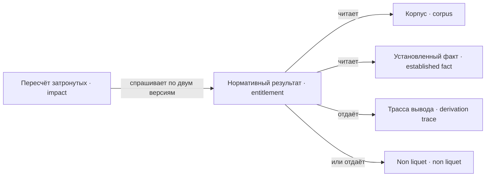

---
tags:
  - понятие
---

# Вывод

Нормативный результат — единственный ответчик на вопрос, что применимо к случаю в периоде. Он читает корпус и факты и отдаёт ответ вместе с трассой вывода, а там, где корпус ответа не даёт, — non liquet. Пересчёт затронутых спрашивает его дважды, по двум версиям корпуса, и вычитает.

## Нормативный результат

`Entitlement`

Ответ на единственный вопрос: **какой нормативный результат применим к этому
случаю в этом периоде**. Отдаётся вместе с
[[docs/concepts/derivation#Трасса вывода|трассой]].

Это единственная точка входа. Ядро, дела, институты, исполнение и
[[docs/concepts/observation#Линтер конституции|линтер]] нигде не спрашивают напрямую, какой документ
выше: [[docs/concepts/law#Приоритет документов|приоритет]], исключения и разрешение
конфликтов спрятаны внутри. Поэтому модель разрешения норм заменяема, не ломая
потребителей.

Заменяемость считается доказанной только тогда, когда сценарные тесты казуса
проходят на подменённой стратегии разрешения.

### Трасса вывода

`DerivationTrace`

Дерево, отвечающее на вопрос «почему у этого человека есть это право»: для
каждого выведенного факта — правило и список посылок, вниз до
[[docs/concepts/cases#Установленный факт|установленных фактов]].

Отдельной механики объяснения не требуется, трасса является побочным продуктом
вывода. Она же служит объяснением игроку и делает
[[docs/concepts/derivation#Нормативный результат|нормативный результат]] заменяемым: потребитель
видит ответ и обоснование, но не устройство.

### Non liquet

`NonLiquet`

«Не ясно»: исход, при котором [[docs/concepts/law#Корпус|корпус]] не даёт по делу
определённого ответа. Дело закрывается без результата, и это записывается в
[[docs/concepts/observation#Журнал|журнал]] наравне с решением.

Не ошибка движка и не отказ считать. Вывод трёхзначен: факт может быть
доказанным, опровергнутым и **ни тем ни другим**. Третье состояние возникает
там, где два правила выводят противоположное, а [[docs/concepts/law#Вытеснение|порядок
вытеснения]] между ними не объявлен, — либо где условие ни подтверждается, ни
опровергается имеющимися фактами.

Существование этого исхода — то, что не даёт правовой базе замкнуться:
противоречивый закон не останавливает мир, а порождает дела, которые ничем не
кончаются. Это и наблюдаемее, и честнее, чем отказ вычислителя принять корпус.

Римская процедура знала ровно это: судья, которому дело не было ясно, приносил
присягу *sibi non liquere* и освобождался от разбирательства.

**Не путать с** отказом в требовании — отказ есть определённый ответ «нет», —
и с [[docs/concepts/observation#Провал конструкции|провалом конструкции]]: одно дело с
неясным исходом является жизнью, а их массовое появление — диагнозом.

## Пересчёт затронутых

`Impact`

Разница состояний между двумя версиями [[docs/concepts/law#Корпус|корпуса]]: кто
затронут правкой и чем именно. Считается детерминированно, без вызовов модели,
кэшируется по паре «период + версия корпуса».

Пересчёт делает три вещи сразу: измеряет ущерб от
[[docs/concepts/law#Ретроактивность|ретроактивности]], избавляет от миграции данных
при правке закона и **порождает дела** — затронутые люди являются поводами.
Модель нужна только чтобы решить, отреагирует ли конкретный человек.

Отсюда же главный риск: одна правка способна задеть многих, поэтому объём дел
на период ограничивается явной очередью с приоритетом и бюджетом, а не тем,
сколько получилось.
