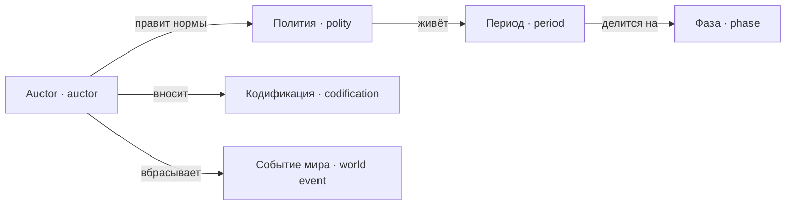

---
tags:
  - понятие
---

# Игра

Кто играет и в каком ритме. Auctor правит нормы политии, находясь вне её; время идёт периодами, период делится на фазы. Auctor действует двумя путями помимо правки норм: кодификацией найденной практики и событиями мира.

## Auctor

`Auctor`

Игрок. Учредительная власть **вне** политии: правит нормы и вбрасывает
[[docs/concepts/game#Событие мира|события мира]] в первой
[[docs/concepts/game#Фаза|фазе]] и не существует внутри второй.

Auctor не является [[docs/concepts/people#Человек|человеком]], не занимает
[[docs/concepts/institutions#Должность|должность]], не может быть стороной
[[docs/concepts/cases#Дело|дела]] и не вмешивается в конкретное дело. Влиять на дела
он может только через норму.

Невмешательство защищено структурой хода, а не отдельной проверкой: в фазе
проживания у auctor просто нет хода.

**Не путать с** человеком внутри симуляции и с институтом, обладающим
[[docs/concepts/institutions#Компетенция|компетенцией]].

### Кодификация

`Codification`

Акт [[docs/concepts/game#Auctor|auctor]], которым устойчивая практика становится
[[docs/concepts/law#Норма|нормой]]. Игрок видит находку
[[docs/concepts/observation#Цензор|цензора]] — «должность решает такие дела вот так» — и
вносит её в корпус собственным решением.

До этого акта находка не решает ничего. Извлечённая из журнала структура
является наблюдением, а не правилом: иначе прошлые ответы модели стали бы
нормой, чего быть не должно.

После акта случай разрешается детерминированно и воспроизводимо, модель к нему
не зовётся.

Исторический прообраз — преторский эдикт: накопленная практика, опубликованная
как правило и связывающая издавшего.

**Не путать с** прецедентом: тот возникает сам из решения по делу, а
кодификация требует отдельного датированного акта.

### Событие мира

`WorldEvent`

Внешнее обстоятельство, которое [[docs/concepts/game#Auctor|auctor]] вбрасывает в
фазе правки: неурожай, война, эпидемия, приток людей. Меняет факты о мире, но
не меняет норм и не разрешает дел.

Событие мира записывается как факт с автором и
[[docs/concepts/game#Период|периодом]] наравне с правкой нормы.

**Не путать с** [[docs/concepts/architecture#Доменное событие|доменным событием]] — техническим
фактом внутри модели.

## Полития

`Polity`

Вымышленное государство, которым игрок управляет через нормы: люди, статусы,
институты, должности и корпус, действующие в одном
[[docs/concepts/game#Период|периоде]].

Римско-вдохновлённая, но не реконструкция: полномочия любого органа задаёт
[[docs/concepts/law#Конституция|конституция]] Intercessio, а историческое название
само по себе ничего не разрешает.

[[docs/concepts/game#Auctor|Auctor]] находится **вне** политии и в фазе проживания
отсутствует. Это единственная граница, которую движок держит сам, а не нормой.

**Не путать с** [[docs/concepts/observation#Граф власти|графом власти]]: тот является
производной картой её устройства на конкретный период.

## Период

`Period`

Единица времени мира и цикл взаимодействия одновременно: целое число, которым
датируются нормы, должности, факты и решения. Внутри периода мир проживает
ограниченный объём работы; между периодами действует только
[[docs/concepts/game#Auctor|auctor]].

Период является также единицей фиксации и повтора: прогон одного и того же
периода на тех же входах даёт тот же результат.

**Не путать с** реальным временем и техническим тиком.

**Связано:** [[docs/concepts/game#Фаза|фаза]],
[[docs/concepts/law#Ретроактивность|ретроактивность]],
[[docs/concepts/law#Корпус|корпус]]

### Фаза

`Phase`

Часть [[docs/concepts/game#Период|периода]]. Фаз три и порядок жёсткий:

1. **правка** — [[docs/concepts/game#Auctor|auctor]] меняет нормы и вбрасывает
   [[docs/concepts/game#Событие мира|события мира]];
2. **проживание** — полития разбирает [[docs/concepts/cases#Дело|дела]]; auctor
   отсутствует;
3. **отчёт** — [[docs/concepts/observation#Отчёт периода|отчёт периода]] и замечания
   [[docs/concepts/observation#Линтер конституции|линтера]].

Последствия своего закона игрок узнаёт только в третьей фазе.

**Не путать с** периодом целиком.

### Стопка

`Stack`

Итог [[docs/concepts/game#Период|периода]], который приходит
[[docs/concepts/game#Auctor|auctor]]: несколько [[docs/concepts/game#Карточка|карточек]],
отобранных из находок [[docs/concepts/observation#Линтер конституции|линтера]], дел и
людей, затронутых правкой. Разобрав стопку, игрок запускает следующий период —
фаза правки и есть разбор стопки.

Отбор детерминирован, размер стопки задан данными. Не попавшее в стопку не теряется,
а остаётся в [[docs/concepts/observation#Отчёт периода|отчёте периода]].

**Не путать с** отчётом периода: отчёт показывает всё, стопка — только то, что требует
решения о законе.

### Карточка

`Card`

Одна причина изменить закон и предложение правки к ней. Повод — находка, дело или
затронутые правкой; одна карточка собирает все находки одного корня, например все
споры без порядка вокруг одного предиката. Auctor принимает предложение, отклоняет
его или пишет норму сам — но дела карточка не решает.

Решённая карточка возвращается только с новым свидетельством: вырос охват или
появились новые люди.

**Не путать с** делом: дело решает полития, карточку — auctor.
