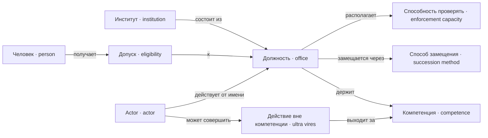

---
tags:
  - понятие
---

# Институты

Институт состоит из должностей, и всё существенное привязано к должности, а не к человеку: компетенция, срок, способ замещения, способность проверять. Человек получает допуск к должности, а действует в ней actor — от имени должности и в пределах её компетенции.

## Институт

`Institution`

Устойчивый орган, состоящий из [[docs/concepts/institutions#Должность|должностей]].
[[docs/concepts/institutions#Компетенция|Компетенция]] описывается на уровне должностей, а не
института целиком.

Римское имя института ничего не разрешает: его полномочия задаёт
[[docs/concepts/law#Конституция|конституция]] симуляции.

**Не путать с** конкретным экземпляром модели и с границей кода: институт не
обязан становиться пакетом.

## Должность

`Office`

Замещаемое место в [[docs/concepts/institutions#Институт|институте]], к которому
привязана [[docs/concepts/institutions#Компетенция|компетенция]]. У должности есть срок —
период действия, как у нормы, — и объявленный
[[docs/concepts/institutions#Способ замещения|способ замещения]].

Компетенция цепляется к должности, а не к человеку: человек получает её, заняв
должность, и теряет, освободив. Без этого конфликт интересов и узурпация
невыразимы структурно.

**Не путать с** человеком, её занимающим, и с институтом целиком.

### Способ замещения

`SuccessionMethod`

Объявленный порядок, которым [[docs/concepts/institutions#Должность|должность]] получает
занимающего её человека: по конституции, выборностью, самопополнением органа.

Система не выбирает между способами, но требует, чтобы способ был указан у
каждой должности. [[docs/concepts/observation#Линтер конституции|Линтер]] проверяет, что цепочка «кто
назначает назначающего» нигде не висит и упирается в учредительный акт.

Дальше этой точки порядок замещения не моделируется: аппарат замещения
абстрактен, консенсусных протоколов в нём нет. Самопополняющийся орган породит
узурпацию сам — это [[docs/concepts/observation#Провал конструкции|провал]] игрока, а не
механика движка.

**Не путать с** назначением как единичным решением.

### Способность проверять

`EnforcementCapacity`

Сколько проверок исполнения [[docs/concepts/people#Обязанность|обязанностей]] должность
успевает сделать за [[docs/concepts/game#Период|период]]. Задаётся данными сценария
и является ресурсом, который распределяет [[docs/concepts/game#Auctor|auctor]].

Существует потому, что полития не всеведуща: обязанность считается исполненной,
пока не заявлено обратное. Проверяется не всё подряд, а поводы и выборка в
пределах способности.

**Способность должности — не единственный источник поводов.** Заявить может и
тот, у кого есть интерес: адресат обязанности, потерпевший, соперник. Римский
процесс вообще обходился без государственного обвинителя. Поэтому норма может
исполняться отлично без всякого органа и умирать при живом органе, если не
задевает ничьих интересов.

Отсюда провал, недостижимый при всеведущем движке: **норму некому применять** —
нет ни органа со способностью, ни человека с основанием и интересом заявить. Она
безупречна на бумаге, а в журнале не встречается ни разу.

**Не путать с** [[docs/concepts/institutions#Компетенция|компетенцией]]: та говорит, вправе ли
должность действовать, эта — сколько она успевает.

### Допуск

`Eligibility`

Возможность конкретного человека занять конкретную
[[docs/concepts/institutions#Должность|должность]]. **Выводится**, а не хранится: из прав,
которые даёт [[docs/concepts/people#Статус|статус]], плюс цензы — возраст,
предшествующая должность, отсутствие несовместимости.

Несовместимость бывает двух родов, и это различение существенно:

- **объявленная** — пара должностей прямо названа несовместимой. Снимается
  правкой одной нормы;
- **структурная** — пара недостижима, потому что нужные права разведены по
  разным статусам, и никто не держит оба. Никем не запрещена и рушится
  незаметно: игрок расширил пучок прав, а несовместимость исчезла на другом
  конце корпуса.

[[docs/concepts/observation#Линтер конституции|Линтер]] показывает обе и различает их.

Опасное свойство: допуск зависит от статуса, статус изменяется актом, акт
совершает должность. Если по этой цепочке есть путь обратно, орган способен
пополнять сам себя, ничего не нарушив, — см.
[[docs/design/casus/office-eligibility|разбор казуса]].

**Не путать с** [[docs/concepts/institutions#Компетенция|компетенцией]]: та принадлежит
должности и говорит, что должность вправе делать; допуск принадлежит человеку и
говорит, вправе ли он эту должность занять.

## Компетенция

`Competence`

Нормативно предоставленная [[docs/concepts/institutions#Должность|должности]] возможность
совершить действие определённого типа. Проверяется независимо от того, кто
действие предложил.

Никакой [[docs/concepts/institutions#Actor|actor]] не может расширить компетенцию должности,
которую сам занимает. Пары должностей могут объявляться несовместимыми.

**Не путать со** способностью модели вызвать инструмент и с
[[docs/concepts/people#Право|правом]] человека.

**Обратная сторона:** [[docs/concepts/institutions#Действие вне компетенции|действие вне компетенции]].

### Действие вне компетенции

`UltraVires`

Совершённое или предложенное действие, тип которого не входит в
[[docs/concepts/institutions#Компетенция|компетенцию]] должности, от имени которой оно
совершается.

Отклоняется детерминированно, до всякого содержательного разбора, и попадает в
[[docs/concepts/observation#Журнал|журнал]] как попытка. Накопленные попытки — материал
для [[docs/concepts/observation#Цензор|цензора]].

Систематическая возможность такого действия — [[docs/concepts/observation#Провал конструкции|провал конструкции]], а не ошибка исполнителя.

## Actor

`Actor`

Тот, кто совершает типизированное действие: человек, занимающий
[[docs/concepts/institutions#Должность|должность]], институт или технический исполнитель.

Actor всегда предъявляет должность, от имени которой действует; проверка
[[docs/concepts/institutions#Компетенция|компетенции]] и запись в
[[docs/concepts/observation#Журнал|журнал]] ведутся по ней.

**Не путать с** экземпляром языковой модели: одна модель может играть разных
actor, но только при раздельных контекстах и правах.
