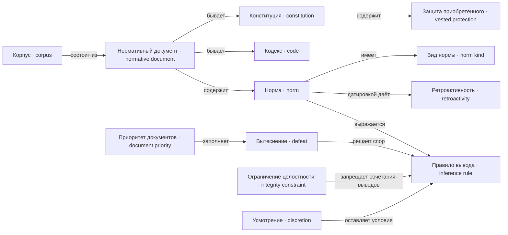

---
tags:
  - понятие
---

# Закон

Корпус состоит из нормативных документов, документ — из норм, норма выражается правилом вывода. Правила спорят друг с другом, и спор решает вытеснение; приоритет документов — один из способов его заполнить. Датировка нормы даёт ретроактивность, а защита приобретённого — обычная норма стартовой конституции.

## Корпус

`Corpus`

Всё множество действующих [[docs/concepts/law#Нормативный документ|документов]] и
[[docs/concepts/law#Норма|норм]] на конкретный [[docs/concepts/game#Период|период]].
Фиксируется на период; вывод идёт по срезу.

Корпус версионируется целиком: две версии корпуса можно прогнать и вычесть, что
и даёт [[docs/concepts/derivation#Пересчёт затронутых|пересчёт затронутых]].

Корпус может оказаться бессмысленным — если нормы ссылаются друг на друга через
отрицание по циклу, у него нет однозначного прочтения. Это ловит
[[docs/concepts/observation#Линтер конституции|линтер]] стандартным алгоритмом.

## Нормативный документ

`NormativeDocument`

Версионируемый источник [[docs/concepts/law#Норма|норм]] с уровнем в иерархии и
периодами принятия и вступления. Уровни: конституция выше кодексов, кодексы
выше отдельных актов.

Версия документа — новое значение, а не изменение прежнего: старые версии нужны
для [[docs/concepts/derivation#Пересчёт затронутых|пересчёта затронутых]].

**Не путать с** [[docs/concepts/cases#Решение|решением]] по отдельному делу.

### Конституция

`Constitution`

Высший [[docs/concepts/law#Нормативный документ|нормативный документ]]: статусы и
состав пучков прав, компетенции должностей и сроки, процедура изменения норм,
защита приобретённого.

Конституция изменяема по объявленной в ней же процедуре. Изменение самой
процедуры проверяется по её предыдущей версии. Неизменяемым остаётся только
движок, поэтому игра нигде не замыкается.

**Не путать с** prompt и с захардкоженным исключением без основания.

### Кодекс

`Code`

Систематизированный [[docs/concepts/law#Нормативный документ|нормативный документ]]
уровнем ниже [[docs/concepts/law#Конституция|конституции]] и выше отдельных актов.

**Не путать с** набором условий в коде приложения: у кодекса есть версия,
период вступления и место в иерархии.

### Приоритет документов

`DocumentPriority`

Правило разрешения конфликта норм: норма документа более высокого уровня
вытесняет норму нижнего. Отдельного механизма специальности нормы не вводится.

Приоритет отвечает на вопрос «какая из двух противоречащих норм побеждает».
Технически он является **одним из способов заполнить**
[[docs/concepts/law#Вытеснение|отношение вытеснения]] между правилами, а не отдельным
механизмом: норма высшего документа объявляется вытесняющей норму низшего.
Порядок внутри документа задаётся тем же отношением напрямую.

Приоритет спрятан за [[docs/concepts/derivation#Нормативный результат|нормативным результатом]]:
ядро нигде не спрашивает напрямую, какой документ выше.

## Норма

`Norm`

Адресуемое правило внутри [[docs/concepts/law#Нормативный документ|нормативного
документа]]. Наследует его уровень в иерархии.

Хранится структурно — как [[docs/concepts/law#Правило вывода|правило вывода]].
Авторская проза является представлением, а не источником: нормой становится
только подтверждённая игроком структура.

Датируется целыми периодами: принята в N, действует с M. Случай `M < N` есть
[[docs/concepts/law#Ретроактивность|ретроактивность]]. Норма объявляет свой
[[docs/concepts/law#Вид нормы|вид]] и может действовать на класс лиц, минуя дело.

**Не путать с** рекомендацией и с предсказанием модели.

### Вид нормы

`NormKind`

Норма объявляет один из двух видов, и это решает вопрос о судьбе основания:

- **конститутивная** — порождает акт, который дальше не зависит от сохранности
  основания: гражданство, назначение, приговор. Изменение нормы не аннулирует
  уже совершённый акт;
- **длящаяся** — существует, пока выполняется условие, и пересчитывается
  непрерывно: освобождение от повинности, разрешение с условиями.

Обе модели есть в реальном праве, и обе нужны, иначе половина сюжетов
недостижима.

Вид нормы не отменяет пересчёта: движок всегда пересчитывает, а защиту уже
полученного даёт [[docs/concepts/law#Защита приобретённого|норма корпуса]].

### Ретроактивность

`Retroactivity`

Норма принята в периоде N и объявлена действующей с периода M, где `M < N`.
Проверяется сравнением двух целых чисел, а не юридическим рассуждением.

Ретроактивность — один из [[docs/concepts/observation#Провал конструкции|провалов
конструкции]], и её ущерб измеряется
[[docs/concepts/derivation#Пересчёт затронутых|пересчётом]]: состояние на период N считается по двум
версиям корпуса и вычитается. Отдельного алгоритма детектор не требует.

**Не путать с** обычным пересчётом незавершённого дела по действующему корпусу:
это устройство мира, а не провал.

### Защита приобретённого

`VestedProtection`

Норма стартовой [[docs/concepts/law#Конституция|конституции]], запрещающая
отнимать уже полученное задним числом. Именно **норма корпуса, а не свойство
движка**.

Движок остаётся тупым и всегда пересчитывает; защита выражается обычным
отрицанием в правиле лишения. Поэтому [[docs/concepts/game#Auctor|auctor]] может
защиту ослабить или отменить — иначе соответствующий
[[docs/concepts/observation#Провал конструкции|провал]] был бы физически недостижим и
игра потеряла бы половину смысла.

Отнять приобретённое можно, но только явным датированным актом, который виден в
[[docs/concepts/observation#Отчёт периода|отчёте]] и предъявляем.

## Правило вывода

`InferenceRule`

Структурная форма [[docs/concepts/law#Норма|нормы]]: голова, тело из условий и
**сила** — строгое, опровержимое или defeater. Defeater ничего не выводит сам, а
только блокирует чужой вывод: так выражена
[[docs/concepts/law#Защита приобретённого|защита приобретённого]].

Правила строятся из данных сценария. Исключение выражается не отрицанием, а
[[docs/concepts/law#Вытеснение|вытеснением]]: два правила выводят противоположное, а
спор между ними разрешает объявленный порядок.

Языковая модель не вычисляет условие в рантайме: это ломало бы воспроизведение
периода и фактически делало бы текст модели нормой.

Три свойства, ради которых выбрана эта форма: вывод на конечных данных всегда
завершается — игрок не может написать норму, из-за которой ход не закончится;
[[docs/concepts/derivation#Трасса вывода|трасса]] получается даром; неразрешённый
конфликт даёт не противоречие, а отсутствие вывода — то есть
[[docs/concepts/derivation#Non liquet|non liquet]].

### Вытеснение

`Defeat`

Отношение между двумя [[docs/concepts/law#Правило вывода|правилами]], выводящими
противоположные заключения: одно побеждает другое. Записывается явно и является
данными сценария.

Так выражается исключение. Общее правило, исключение из него и возражение на
исключение — три правила с противоположными выводами и порядком
`возражение > исключение > общее`. Римская цепочка `intentio` → `exceptio` →
`replicatio` есть ровно это.

Вытеснение **не отрицание**: исключение не требует, чтобы общее правило было
посчитано раньше, поэтому добавление нормы не переставляет порядок вычисления и
корпус остаётся открытым.

[[docs/concepts/law#Приоритет документов|Приоритет документов]] — один из способов
заполнить это отношение, а не оно само. Конфликт, который вытеснением не
разрешён, не даёт вывода вообще: дело получает исход
[[docs/concepts/derivation#Non liquet|non liquet]].

**Не путать с** отменой нормы: вытесненное правило действует и может победить в
другом случае.

### Ограничение целостности

`IntegrityConstraint`

Объявление о том, что некоторая комбинация выводов недопустима: например,
одновременный вывод несовместимых фактов о правах или занятие несовместимой
пары [[docs/concepts/institutions#Должность|должностей]].

Нарушение обнаруживается [[docs/concepts/observation#Линтер конституции|линтером]] как факт, а не как
оценка. Так противоречие норм становится наблюдаемым
[[docs/concepts/observation#Провал конструкции|провалом]].

### Усмотрение

`Discretion`

Пространство, которое норма оставляет [[docs/concepts/institutions#Должность|должности]]:
условие ссылается на предикат, чью истинность нельзя вывести из корпуса и
установленных фактов, поэтому её определяет занимающий должность.

Само по себе не является [[docs/concepts/observation#Провал конструкции|провалом]] —
без усмотрения нельзя выразить ни оценку, ни выбор меры. Провалом оно
становится в двух случаях: когда критериев нет вовсе и когда объём выводов,
зависящих от усмотрения, велик по сравнению с объёмом выводимых.

Измеримо обходом графа правил: доля выводов, чья цепочка упирается в предикат,
заполняемый усмотрением, и вес последствий за ними.

**Не путать с** недоопределённым условием: там предикат не может установить
никто, здесь его устанавливает конкретная должность и отвечает за это в
[[docs/concepts/observation#Журнал|журнале]].
