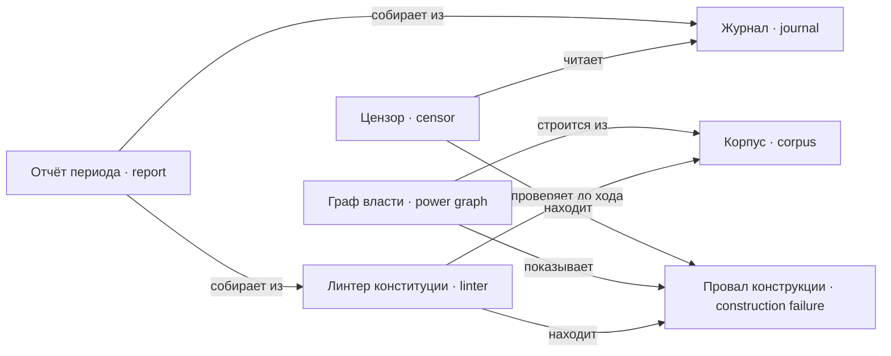

---
tags:
  - понятие
---

# Наблюдение

Чем провалы конструкции становятся видимыми. Линтер проверяет корпус до хода, граф власти показывает устройство на период, журнал хранит прожитое, цензор ищет в нём закономерности, отчёт периода собирает всё это для игрока.

## Провал конструкции

`ConstructionFailure`

Наблюдаемый дефект корпуса или практики: противоречие норм, неисполнимость,
[[docs/concepts/law#Ретроактивность|ретроактивность]], слишком частая смена закона,
недоведение нормы до тех, кого она касается, дыра в
[[docs/concepts/institutions#Компетенция|компетенции]], недостижимый или зацикленный
[[docs/concepts/cases#Пересмотр|пересмотр]], узурпация.

Провал — это **приз партии**, а не ошибка системы: игрок затем и играет, чтобы
увидеть, каким именно способом ломается его конструкция.

Полный каталог с детекторами — [[docs/guide/04-what-goes-wrong|глава 4]].

**Не путать с** проигрышем игрока и с багом движка.

## Линтер конституции

`Linter`

Детерминированная проверка свойств [[docs/concepts/law#Корпус|корпуса]] **до** хода:
нестратифицируемость, недостижимость вывода, дыра в покрытии компетенций,
цикл пересмотра, висящий [[docs/concepts/institutions#Способ замещения|способ замещения]],
[[docs/concepts/law#Ретроактивность|ретроактивность]].

Строится поверх [[docs/concepts/derivation#Нормативный результат|нормативного результата]] и
спрашивает «есть ли случаи с неопределённым или противоречивым результатом», а
не сравнивает уровни документов сам.

Линтер видит не всё. Тихие провалы — норма, ни разу не применившаяся, и путь
пересмотра, которым не воспользовались, — формально корректны и считаются по
[[docs/concepts/observation#Журнал|журналу]].

**Не путать с** оценкой справедливости и с мнением модели.

## Граф власти

`PowerGraph`

Карта в игре, но не карта территории. Узлы — [[docs/concepts/institutions#Должность|должности]],
рёбра — компетенции, сдерживание, назначение и допуск.

Не хранится, а **строится на период** из корпуса и фактов: кто какую должность
занимает, какие нормы действуют, что приостановлено. Объявленный граф и
действующий расходятся, и осмысленны только проверки по действующему.

На нём читается значительная часть [[docs/concepts/observation#Провал конструкции|провалов
конструкции]]: тупик пересмотра — узел без входящего ребра сдерживания, цикл
обжалования — кольцо, дыра в покрытии — вид действия, которого не может никто,
замкнутый допуск — путь от компетенции обратно к допуску в ту же должность.

Отрисовывается на период, периоды листаются. Устройство —
[[docs/design/components/power-graph|design/components/power-graph]].

**Не путать с** картой мира: территории в игре нет.

## Отчёт периода

`Report`

Третья [[docs/concepts/game#Фаза|фаза]] хода: что произошло за период, что нашёл
[[docs/concepts/observation#Линтер конституции|линтер]], кого задела правка закона и поимённо кто
лишился приобретённого.

Отчёт — основной канал, которым игрок узнаёт о
[[docs/concepts/observation#Провал конструкции|провалах]] своей конструкции.

## Журнал

`Journal`

Запись всего, что произошло, с [[docs/concepts/cases#Провенанс|провенансом]]: actor,
должность, версия компетенции, версия нормы, correlation ID, исход.

Пишется в том же переходе, что и сам переход, с самого первого дня — даже пока
[[docs/concepts/observation#Цензор|цензора]] нет. Иначе позже его не на чем строить.

Журнал — единственный источник для тихих провалов, которые
[[docs/concepts/observation#Линтер конституции|линтер]] не ловит.

## Цензор

`Censor`

Аналитический контур поверх [[docs/concepts/observation#Журнал|журнала]]: узурпация,
сговор, конфликт интересов, расхождение практики с нормой, советы и
оптимизации.

Отдельный поздний этап. У цензора **нет компетенции решать** — именно это не
даёт аналитике стать скрытой высшей властью.

**Не путать с** [[docs/concepts/observation#Линтер конституции|линтером]]: линтер смотрит на корпус до
хода, цензор — на историю после.

**И не путать с должностью `censor`** из разобранных казусов. Там это
[[docs/concepts/institutions#Должность|должность]] с компетенциями устанавливать факты о людях,
совершать усыновление и налагать ноту — участник политии, а не наблюдатель над
ней. Совпадение имени историческое и неудачное; при первом же столкновении в
коде одно из двух переименовывается.
