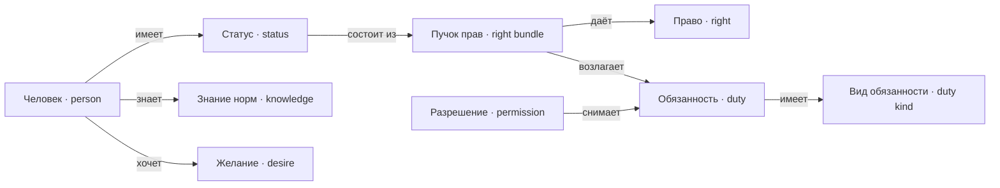

---
tags:
  - понятие
---

# Люди

Человек хранит факты о себе, но не права и обязанности: они выводятся из статуса и норм периода. Статус — пучок прав и обязанностей; обязанность бывает двух видов и снимается разрешением. Желание и знание норм влияют на поведение человека, но не на то, что ему положено.

## Человек

`Person`

Симулируемый субъект: идентичность, установленные о нём
[[docs/concepts/cases#Установленный факт|факты]], занятие
[[docs/concepts/institutions#Должность|должностей]], поданные
[[docs/concepts/cases#Прошение|прошения]], [[docs/concepts/people#Желание|желания]] и
[[docs/concepts/people#Знание норм|знание норм]].

Человек хранится всю партию и переносим: он состоит из фактов и черт, а не из
живого контекста модели. Его [[docs/concepts/people#Право|права]] и
[[docs/concepts/people#Обязанность|обязанности]] не хранятся, а выводятся.

**Не путать с** реальным пользователем приложения и с
[[docs/concepts/game#Auctor|auctor]]; из наличия человека не следует
[[docs/concepts/people#Статус|статус]].

### Желание

`Desire`

Внутренняя цель человека, возможно неполная и противоречивая. Вместе со
[[docs/concepts/people#Знание норм|знанием норм]] определяет, подаст ли человек
[[docs/concepts/cases#Прошение|прошение]].

Желание никогда не является основанием вывода: оно влияет на поведение, а не на
то, есть ли у человека [[docs/concepts/people#Право|право]].

**Не путать с** поданным прошением и с правом.

### Знание норм

`Knowledge`

Какие нормы попали в контекст конкретного [[docs/concepts/people#Человек|человека]].
Данные: детерминированно, воспроизводимо, задаётся сценарием и действиями
политии.

Знание отделено от способности рассуждать. Способность задаётся силой модели,
играющей человека, и является источником человеческой ошибки. Разделение
обязательно для чистоты диагноза: «не знал, потому что норма не была доведена»
— это [[docs/concepts/observation#Провал конструкции|провал конструкции]]; «знал, но
перепутал» — не провал.

Ограниченное знание одновременно является защитой: человек не видит материалов,
которых видеть не должен.

**Не путать со** способностью модели и с наличием права.

## Статус

`Status`

Именованный [[docs/concepts/people#Пучок прав|пучок прав]] **и обязанностей**,
который человек имеет. Не позиция на одномерной шкале: `peregrinus` и `civis`
различаются составом пучка, а не «уровнем».

Обязанности в статусе — не редкость, а обычное дело: вольноотпущенник имеет
неполный пучок прав и сверх того несёт обязанности перед патроном. Статус,
который умеет только давать, описывает половину случаев.

Факт «человек имеет статус X» хранится; «что даёт статус X» выводится из норм
[[docs/concepts/game#Период|периода]]. Статус может быть основанием другого статуса,
поэтому образует граф зависимостей.

**Наследуемость — свойство конкретного статуса, а не общее правило.**
Гражданство передаётся по рождению, состояние вольноотпущенника — нет: его дети
рождаются свободными. Записывать наследование как универсальное правило значит
сделать половину статусов невыразимой.

Всё, что даётся, должно уметь отниматься: у статуса есть явное основание утраты.
Утрата статуса — обычное последнее звено цепочки последствий, потому что это
акт политии, а не очередное требование к человеку.

**Не путать с** [[docs/concepts/people#Право|правом]] и с флагом «гражданин да/нет».

### Пучок прав

`RightBundle`

Именованное подмножество [[docs/concepts/people#Право|прав]], которое даёт
[[docs/concepts/people#Статус|статус]]. Задаётся нормой и является данными сценария.

У пучка прав есть двойник — **пучок обязанностей**: статус может не только
давать, но и возлагать. Устроены они одинаково и различаются только тем, что
попадает внутрь.

Пучок даёт бесплатно две вещи: частичные статусы (есть коммерческие права, нет
права голоса) и приостановку отдельного права без изобретения новой сущности.

**Не путать со** статусом как одномерной шкалой.

## Право

`Right`

Защищённая нормой возможность требовать действие или воздержание. **Выводится**
из [[docs/concepts/people#Статус|статуса]], норм периода и установленных фактов; в
состоянии человека не хранится.

Следствие: правка закона автоматически догоняет уже существующих людей, и
мигрировать нечего.

**Не путать с** техническим permission, с [[docs/concepts/people#Желание|желанием]] и с
[[docs/concepts/institutions#Компетенция|компетенцией]] — компетенция принадлежит должности,
а не человеку.

## Обязанность

`Duty`

Требование нормы к [[docs/concepts/people#Человек|человеку]] или
[[docs/concepts/institutions#Должность|должности]]. Может возникать из отдельной нормы или
входить в [[docs/concepts/people#Статус|статус]] наравне с правами. Не флаг и не голый вывод: у обязанности есть
**носитель** (кто обязан), **адресат** (перед кем), **условие исполнения**,
**срок в периодах** и [[docs/concepts/people#Вид обязанности|вид]].

Адресат отвечает на вопрос, кто вправе начать дело из-за неисполнения. Если
адресат конкретен, у дела есть естественный заявитель; если обязанность лежит
перед политией вообще, кто-то должен быть компетентен преследовать, и отсутствие
такой должности — дыра.

Выводится из норм периода и установленных фактов, а не хранится у человека —
как и [[docs/concepts/people#Право|право]]. Хранятся только действия: исполнено то-то в
таком-то периоде.

Состояний три, и все выводимые: **ожидает**, **исполнена**,
[[docs/concepts/cases#Нарушение|нарушена]]. Исполнение презюмируется, пока не заявлено
обратное: полития не всеведуща, и её
[[docs/concepts/institutions#Способность проверять|способность проверять]] конечна. Нарушение может повлечь
[[docs/concepts/cases#Последствие нарушения|вторичную обязанность]].

**Запрет** — это обязанность обратного, отдельной сущности не требует.
**[[docs/concepts/people#Разрешение|Разрешение]]** — это правило, блокирующее вывод об
обязанности или запрете.

Обязанность и право — две стороны одного отношения: если человек вправе
требовать, кто-то обязан предоставить. Право, которому не соответствует ничья
обязанность, ничего не значит, и это
[[docs/concepts/observation#Провал конструкции|провал конструкции]].

**Не путать с** [[docs/concepts/architecture#Команда|командой]] и с запланированным эффектом.

### Вид обязанности

`DutyKind`

[[docs/concepts/people#Обязанность|Обязанность]] объявляет, чем считается её исполнение, и
видов ровно два:

- **достижение** — должна быть исполнена однажды до срока. Претор обязан
  разрешить дело, человек обязан подать отчёт. Нарушается **по истечении
  срока**, если не исполнена;
- **состояние** — должна выполняться всё время, пока лежит. Гражданин несёт
  повинность, назначенный не покидает провинцию. Нарушается **в любой период
  внутри срока**, когда не выполняется.

Различение не косметическое: у видов разные условия нарушения и разное
отслеживание между периодами. Обязанность-состояние приходится проверять каждый
период, обязанность-достижение — только на границе срока.

**Не путать с** [[docs/concepts/law#Вид нормы|видом нормы]]: тот говорит о судьбе
основания, этот — о том, чем считается исполнение.

### Разрешение

`Permission`

Правило, которое **ничего не выводит и только блокирует** вывод об
[[docs/concepts/people#Обязанность|обязанности]] или запрете. Технически — тот же defeater,
которым выражена [[docs/concepts/law#Защита приобретённого|защита приобретённого]].

Отдельной машинерии не требует: освобождение от повинности является
разрешением, действующим, пока выполняется его условие.

Отсюда полезное свойство: разрешение не доказывает, что действие правомерно
вообще, — оно лишь снимает конкретный запрет. Снятие разрешения возвращает
запрет автоматически, потому что блокировавшее правило перестаёт срабатывать.

**Не путать с** [[docs/concepts/people#Право|правом]]: право даёт возможность
требовать, разрешение только снимает препятствие. И с
[[docs/concepts/institutions#Компетенция|компетенцией]]: та принадлежит должности и говорит,
какие действия она вправе совершать.
