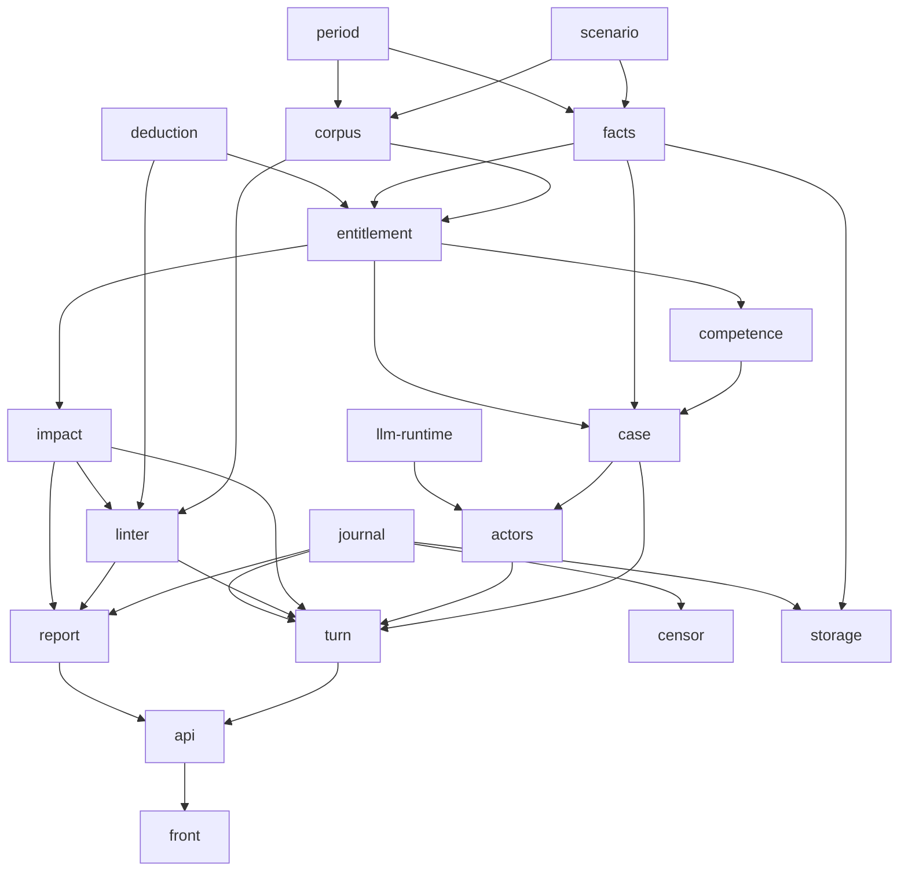

---
tags:
  - устройство
---

# Устройство ядра

Слой между замыслом и кодом: как компоненты устроены внутри и почему именно
так. Обзор — в [[docs/guide/05-how-it-is-built|главе 5]], сюда ходят за
подробностями.

Всё здесь не зависит от провайдера, транспорта и хранилища. Ядро работает в
памяти; выбор инфраструктуры лежит в [[docs/impl/README|impl]] и выбрасывается
без последствий для этого слоя.

- [[docs/design/milestones|milestones]] — порядок сборки: что добавляет каждая
  веха, что демонстрирует и какой у неё гейт;
- [[docs/design/deduction|deduction]] — вычислитель: сила правил, вытеснение,
  безопасность, оценка, трасса;
- [[docs/design/entitlement|entitlement]] — единственный ответчик и
  обязательство заменяемости;
- [[docs/design/corpus-and-facts|corpus-and-facts]] — версии корпуса,
  неизменяемые факты, интервалы;
- [[docs/design/turn-and-case|turn-and-case]] — три фазы, переход, путь дела;
- [[docs/design/actors-and-llm|actors-and-llm]] — роли моделей, изоляция,
  уровни риска, угрозы;
- [[docs/design/censor|censor]] — аналитический контур и стенд: по каким осям
  видно, куда ведёт конструкция;
- [[docs/design/testing|testing]] — уровни проверки, реплей периода, тест
  заменяемости;
- [[docs/design/casus-citizenship|casus-citizenship]] — первый разобранный
  казус: статус, вытеснение, обязанности;
- [[docs/design/casus-office-eligibility|casus-office-eligibility]] — второй:
  частичные статусы, несовместимость должностей, обходимое условие допуска.

## Граф зависимостей

