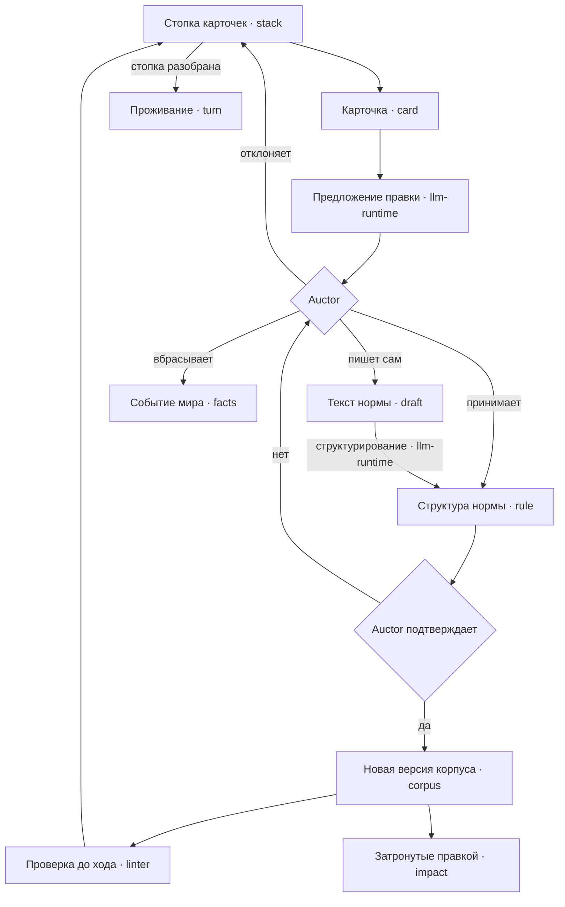
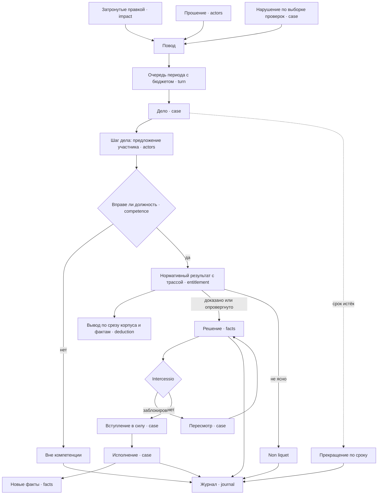
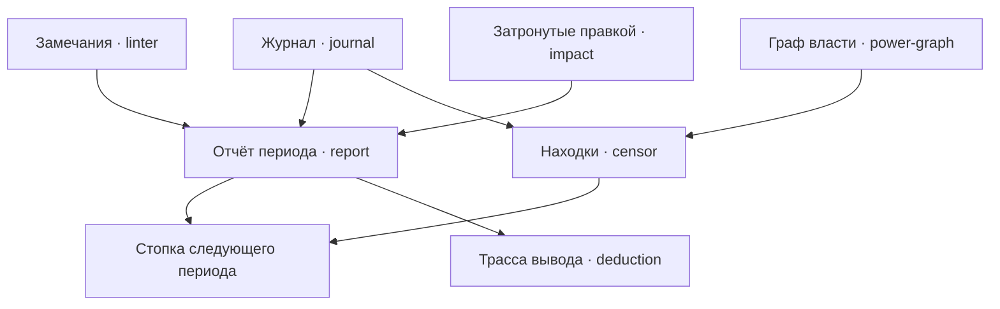
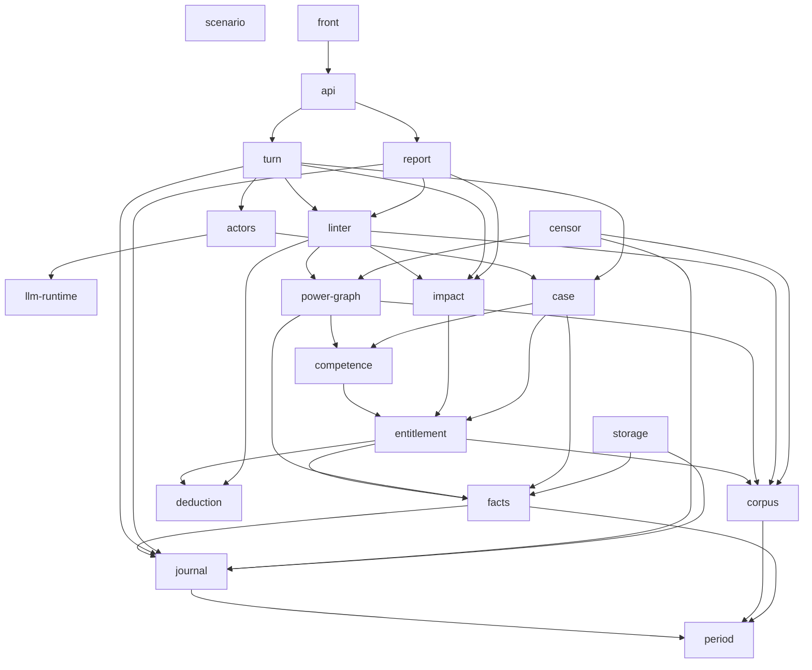

---
tags:
  - устройство
---

# Устройство ядра

Слой между замыслом и кодом: из каких компонентов состоит ядро, кто чем владеет,
кто от кого зависит, как по ним проходит ход партии и в каком порядке это
собирается. Замысел — в [[docs/guide/01-what-it-is|guide]], сюда приходят за
архитектурой.

**Эта страница читается подряд** и понятна без перехода в карточки. Всё
остальное в каталоге — справка:

- `components/` — карточки компонентов: назначение, владение, что компонент
  отдаёт и что берёт, чего не знает. Во frontmatter карточки — `component`
  (слаг, равный имени файла), `owns` и `requires` (списки или `[]`) и `seam`
  (`false` либо имя шва — компонента, где живёт подстановка);
- `casus/` — разобранные казусы, рабочие примеры, на которых проверяется, что
  контракты достаточны;
- `stages/` — вехи, по файлу на веху;
- [[docs/design/predicate-schema|predicate-schema]] и
  [[docs/design/testing|testing]] — сквозные документы.

Всё здесь не зависит от провайдера, транспорта и хранилища. Ядро работает в
памяти; выбор инфраструктуры лежит в [[docs/impl/README|impl]] и выбрасывается
без последствий для этого слоя. Основание раскладки —
[[docs/decisions/design-layer-has-a-spine-and-component-cards|design-layer-has-a-spine-and-component-cards]].

## Компоненты и почему границы проходят здесь

Границы проведены по владельцам данных и инвариантам, а не по техническим
слоям. Компонентов двадцать, и они складываются в семь групп.

**Основание.** [[docs/design/components/period|period]] — номер периода,
интервалы и арифметика над ними. [[docs/design/components/journal|journal]] —
запись всего произошедшего с провенансом. Журнал зависит только от периода,
которым датируется запись.

**Вывод.** [[docs/design/components/deduction|deduction]] — вычислитель:
правила с силой, вытеснение, три исхода, трасса. Он намеренно не знает ничего о
предметной области и о документах, поэтому проверяется синтетическими
программами. [[docs/design/components/entitlement|entitlement]] — единственный
ответчик на вопрос «какой нормативный результат применим к случаю в периоде».
Он один знает, что конституция выше кодекса: заполняет отношение вытеснения и
передаёт его вычислителю. Граница между ними и есть шов заменяемости модели
разрешения норм.

**Данные мира.** [[docs/design/components/scenario|scenario]] читает пресет —
начальные данные партии — и проверяет их форму.
[[docs/design/components/corpus|corpus]] держит версии нормативного корпуса и
отдаёт срез на период. [[docs/design/components/facts|facts]] держит
неизменяемые факты с провенансом. Граница «корпус против фактов» проходит по
линии «выводимое против хранимого»: правка закона не требует миграции, потому
что права не хранятся.

**Институты.** [[docs/design/components/competence|competence]] отвечает,
вправе ли должность совершить действие.
[[docs/design/components/power-graph|power-graph]] строит действующий граф
должностей на период; данными не владеет и выбрасывается после периода.

**Наблюдение.** [[docs/design/components/impact|impact]] — разница состояний
между двумя версиями корпуса. [[docs/design/components/linter|linter]] —
проверки корпуса до хода. [[docs/design/components/report|report]] — отчёт
периода. [[docs/design/components/censor|censor]] — аналитика поверх журнала без
права решать. Они не блокируют проживание, но из их выхода собирается стопка
карточек игрока, поэтому нужны к первой играбельной версии.

**Дело и ход.** [[docs/design/components/case|case]] ведёт дело от прошения до
исполнения и держит жизненный цикл обязанностей между периодами.
[[docs/design/components/actors|actors]] определяет, что участник видит и может,
и получает его действие от заглушки или модели.
[[docs/design/components/llm-runtime|llm-runtime]] вызывает модели с изоляцией,
бюджетом и записью для воспроизведения; предметной области не знает.
[[docs/design/components/turn|turn]] проводит период через три фазы и пишет
журнал в том же переходе.

**Наружу и хранение.** [[docs/design/components/api|api]] — контракт наружу,
[[docs/design/components/front|front]] — то, что видит игрок,
[[docs/design/components/storage|storage]] — реальный адаптер вместо памяти.

## Ход партии по шагам

Обзор цикла из трёх фаз и стопки — в
[[docs/guide/02-the-world|главе 2]]. Здесь — какие компоненты участвуют на
каждом шаге. Основание формы —
[[docs/decisions/player-works-a-stack-of-proposals|player-works-a-stack-of-proposals]].

### Правка: игрок разбирает стопку

Модель советует, решает auctor: нормой становится только структура, которую он
подтвердил, и её до хода проверяет линтер. Как событие мира превращается в факт,
не спроектировано.

### Проживание: дело проходит путь

Детерминированная часть проверяет компетенцию и применимость, у каждого исхода
есть трасса вывода. Утверждение участника-модели сверяется с трассой — так игрок
может проверить, не врёт ли модель.

### Отчёт: из итога собирается следующая стопка

Какой компонент собирает стопку из отчёта и находок, не решено — см. «Не решено»
ниже.

## Граф зависимостей

Стрелка идёт **от потребителя к поставщику**: `turn --> case` значит, что `turn`
берёт что-то из `case`. Граф проверяется скриптом против поля `requires` в
карточках и обязан с ним совпадать.

Листья — `period`, `deduction`, `llm-runtime` и `scenario`: их можно делать в
любой момент. Но лист `scenario` условный — см. «Не решено» ниже.

## Владение

Каждая сущность принадлежит ровно одному компоненту; остальные её только
читают. Проверяется скриптом по полю `owns` в карточках.

| Сущность | Владелец |
| --- | --- |
| период | `period` |
| журнал | `journal` |
| трасса вывода | `deduction` |
| запись вызова модели | `llm-runtime` |
| сценарий | `scenario` |
| документ, норма, вид нормы, версия корпуса | `corpus` |
| установленный факт, решение, прошение, занятие должности | `facts` |
| нормативный результат | `entitlement` |
| компетенция | `competence` |
| пересчёт затронутых | `impact` |
| граф власти | `power-graph` |
| дело, пересмотр, intercessio, вступление в силу, исполнение | `case` |
| знание норм | `actors` |
| фаза | `turn` |
| отчёт периода | `report` |
| стенд, находка практики | `censor` |

### Не решено

Единственное место, где перечислены нерешённые вопросы владения; открытые
вопросы и карточки ссылаются сюда. Пока пункт не решён, сущность не записана ни
за одним компонентом.

| Что | Кандидаты | Где проявляется |
| --- | --- | --- |
| типы правил и отношения вытеснения — `Rule`, `Literal`, `Defeat` | `deduction`; `scenario`; отдельный словарь правил | `scenario` определяет их, `deduction` нужны они же, оба объявлены листьями |
| `Finding` и проверки, общие с загрузчиком | `linter`; собственная диагностика `deduction`; загрузчик делится на разбор и проверку | `scenario` возвращает `Finding` линтера и выполняет его проверки |
| направление между `scenario` и `corpus`, `facts` | сценарий требует их типов; они требуют сценария | прежний граф рисовал второе, спецификация загрузчика описывает первое |
| объявление должности | `corpus`; `competence`; `scenario` | компетенции и сроки — нормы конституции, а должности были записаны за `competence` |
| очередь проверок обязанностей и выборка | `case`; отдельный компонент принуждения | `case` владеет путём дела и циклом обязанностей одновременно |
| состав записи журнала | `journal`; `censor` | поля перечислены у цензора, пишет `turn`, тип записи нигде |
| сборка стопки карточек и предложение правки | `report`; `turn`; новый компонент | форма хода принята, владельца у стопки и у роли советника нет |

Первые три определяют форму загрузчика и блокируют веху
[[docs/design/stages/scenario-loader|scenario-loader]].

## Общий словарь

Всё, чем корпус вправе оперировать, собрано в
[[docs/design/predicate-schema|схеме предикатов]]. Это главная точка
связанности проекта: её используют `corpus`, `facts`, `deduction`,
`entitlement`, `case`, `competence`, `linter` и `power-graph`. Какой компонент
владеет её кодовым представлением — первая строка таблицы «Не решено».

## Четыре шва

Интерфейс заводится только там, где подстановка действительно наблюдается:

1. **`entitlement`** — стратегия разрешения норм. Единственный шов,
   существующий ради будущей замены, а не ради тестов;
2. **`actors`** — детерминированная заглушка против LLM-участника;
3. **`llm-runtime`** — живой вызов против записанного выхода;
4. **`storage`** — память против реального адаптера.

Карточка каждого из них помечает шов в поле `seam`.

## Критический путь и вехи

Критический путь по компонентам: `deduction` → `corpus` + `facts` →
`entitlement` → `case` → `turn`. Всё остальное висит сбоку. Загрузчик сценария
идёт раньше вычислителя не потому, что стоит на пути, а потому, что заставляет
схему предикатов существовать машинно, — см. веху `scenario-loader`.

Вехи идентифицируются слагом; порядок задан полем `Зависит от` в файле вехи и
выведен из зависимостей компонентов.

| Веха | Что добавляется | Зависит от |
| --- | --- | --- |
| [[docs/design/stages/scenario-loader\|scenario-loader]] | загрузчик сценария | — |
| [[docs/design/stages/derivation\|derivation]] | `deduction`, `period` | — |
| [[docs/design/stages/derived-state\|derived-state]] | `corpus`, `facts`, `entitlement`, `scenario` | derivation, scenario-loader |
| [[docs/design/stages/corpus-checks\|corpus-checks]] | `impact`, `linter`, `power-graph` | derived-state |
| [[docs/design/stages/playable-case\|playable-case]] | `competence`, `case`, `actors` заглушками, `turn`, `journal` | derived-state |
| [[docs/design/stages/live-actors\|live-actors]] | `llm-runtime`, LLM-реализация `actors` | playable-case |
| [[docs/design/stages/self-generated-cases\|self-generated-cases]] | `impact` как источник поводов | corpus-checks, playable-case |
| [[docs/design/stages/external-view\|external-view]] | `api`, `report`, `front` | playable-case, corpus-checks |
| [[docs/design/stages/censor-stand\|censor-stand]] | `censor` | playable-case |
| [[docs/design/stages/durable-storage\|durable-storage]] | `storage` | playable-case |

Путь до играбельной партии без интерфейса и без моделей: `derivation` →
`derived-state` → `playable-case`. Порядок остальных вех следует зависимостям
компонентов и отдельного решения не требует.

Метацель проекта — инженерная поверхность AI-стороны — появляется только на
`live-actors`; `llm-runtime` и `journal` ни от чего в домене не зависят и могут
вестись раньше.

## Казусы

Каждый берётся ради того, чего не показали предыдущие:

- [[docs/design/casus/citizenship|citizenship]] — статус, вытеснение,
  обязанность и её нарушение;
- [[docs/design/casus/office-eligibility|office-eligibility]] — частичные
  статусы, несовместимость должностей, обходимое условие допуска;
- [[docs/design/casus/censorial-note|censorial-note]] — приостановка отдельного
  права, акт помимо дела, коллегиальность как противовес;
- [[docs/design/casus/colleagues|colleagues]] — intercessio между равными,
  симметричный тупик, утрата должности посреди срока;
- [[docs/design/casus/decemvirate|decemvirate]] — орган без противовеса и
  терминальное состояние.

## Правила проектирования, выведенные по ходу

Не решения — приёмы, которые повторились достаточно раз, чтобы их назвать.
Каждый выведен из разбора казуса, а не придуман заранее.

- **Защита живёт в корпусе, а не в движке.** Вшитый в движок запрет делает
  соответствующий провал недостижимым, а недостижимые провалы — те самые, ради
  которых игру запускают. Так сделано с защитой приобретённого; так же должно
  быть сделано с разделением полномочий.
- **Варианты — данные, механизм — код.** Продолжение правила «пороги — данные,
  проверки — код». Интерфейс заводится только там, где подставляется целая
  стратегия; таких мест четыре.
- **Провал вносится в каталог сразу, с пометкой, что проверки нет.** Пометка
  снимается тем же изменением, что добавляет проверку: каталог может обгонять
  код, но это видно в каждой строке.
- **Точка расширения оправдана двумя вариантами из казуса**, дающими разные
  записи в отчёте. Новая требует нового казуса, а не рассуждения о будущем.
- **Интервалы вместо перечислений.** Длящееся обстоятельство хранится одним
  интервалом; иначе в вычислитель протащится агрегация.
- **Линтер вправе считать, вычислитель — нет.** Требования к составу органа
  говорят о множестве и выражаются ограничением целостности.
- **Граф власти считается действующий, а не объявленный** — на конкретный
  период, по срезу корпуса и фактов.
- **У каждого полномочия должен быть выход, и он не должен принадлежать тому,
  кто это полномочие держит.** Общая форма провалов о несменяемости.
- **Спецификация готова, когда по ней можно реализовать, не спрашивая, что
  имелось в виду.** Непонятное при реализации — дефект спецификации, а не
  вопрос.
