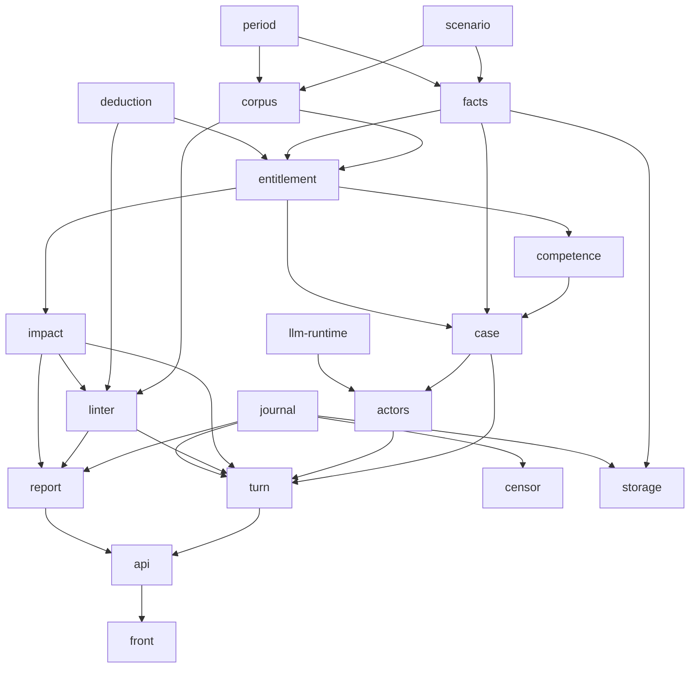

---
tags:
  - устройство
---

# Устройство ядра

Слой между замыслом и кодом: как компоненты устроены внутри и почему именно
так. Обзор — в [[docs/guide/05-how-it-is-built|главе 5]], сюда ходят за
подробностями.

Всё здесь не зависит от провайдера, транспорта и хранилища. Ядро работает в
памяти; выбор инфраструктуры лежит в [[docs/impl/README|impl]] и выбрасывается
без последствий для этого слоя.

- [[docs/design/milestones|milestones]] — порядок сборки: что добавляет каждая
  веха, что демонстрирует и какой у неё гейт;
- [[docs/design/predicate-schema|predicate-schema]] — всё, чем корпус вправе
  оперировать, в одном месте; там же список известных дефектов казусов;
- [[docs/design/scenario|scenario]] — данные мира и загрузчик с проверками:
  компонент, с которого начинается код;
- [[docs/design/deduction|deduction]] — вычислитель: сила правил, вытеснение,
  безопасность, оценка, трасса;
- [[docs/design/entitlement|entitlement]] — единственный ответчик и
  обязательство заменяемости;
- [[docs/design/corpus-and-facts|corpus-and-facts]] — версии корпуса,
  неизменяемые факты, интервалы;
- [[docs/design/turn-and-case|turn-and-case]] — три фазы, переход, путь дела;
- [[docs/design/actors-and-llm|actors-and-llm]] — роли моделей, изоляция,
  уровни риска, угрозы;
- [[docs/design/power-graph|power-graph]] — должности и связи между ними:
  на нём считается треть каталога и пять осей стенда;
- [[docs/design/censor|censor]] — аналитический контур и стенд: по каким осям
  видно, куда ведёт конструкция;
- [[docs/design/testing|testing]] — уровни проверки, реплей периода, тест
  заменяемости;
Разобранные казусы, по порядку — каждый берётся ради того, чего не показали
предыдущие:

1. [[docs/design/casus-citizenship|casus-citizenship]] — статус, вытеснение,
   обязанность и её нарушение;
2. [[docs/design/casus-office-eligibility|casus-office-eligibility]] — частичные
   статусы, несовместимость должностей, обходимое условие допуска;
3. [[docs/design/casus-censorial-note|casus-censorial-note]] — приостановка
   отдельного права, акт помимо дела, коллегиальность как противовес;
4. [[docs/design/casus-colleagues|casus-colleagues]] — intercessio между
   равными, симметричный тупик, утрата должности посреди срока;
5. [[docs/design/casus-decemvirate|casus-decemvirate]] — орган без противовеса и
   терминальное состояние.

## Граф зависимостей

## Правила проектирования, выведенные по ходу

Не решения — приёмы, которые повторились достаточно раз, чтобы их назвать.
Каждый выведен из разбора казуса, а не придуман заранее.

1. **Защита живёт в корпусе, а не в движке.** Вшитый в движок запрет делает
   соответствующий провал недостижимым, а недостижимые провалы — те самые, ради
   которых игру запускают. Так сделано с защитой приобретённого; так же должно
   быть сделано с разделением полномочий.
2. **Варианты — данные, механизм — код.** Продолжение правила «пороги — данные,
   проверки — код». Интерфейс заводится только там, где подставляется целая
   стратегия; таких мест четыре.
3. **Новый провал попадает в каталог только вместе с проверкой в коде.** Запись
   стоит абзац, проверка — день, и без правила каталог обгоняет код всегда.
4. **Точка расширения оправдана двумя вариантами из казуса**, дающими разные
   записи в отчёте. Новая требует нового казуса, а не рассуждения о будущем.
5. **Интервалы вместо перечислений.** Длящееся обстоятельство хранится одним
   интервалом; иначе в вычислитель протащится агрегация.
6. **Линтер вправе считать, вычислитель — нет.** Требования к составу органа
   говорят о множестве и выражаются ограничением целостности.
7. **Граф власти считается действующий, а не объявленный** — на конкретный
   период, по срезу корпуса и фактов.
8. **У каждого полномочия должен быть выход, и он не должен принадлежать тому,
   кто это полномочие держит.** Общая форма провалов о несменяемости.
9. **Спецификация готова, когда по ней можно реализовать, не спрашивая, что
   имелось в виду.** Непонятное при реализации — дефект спецификации, а не
   вопрос.
