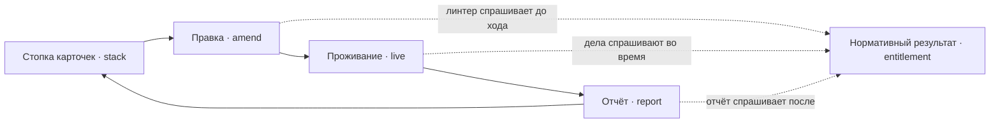
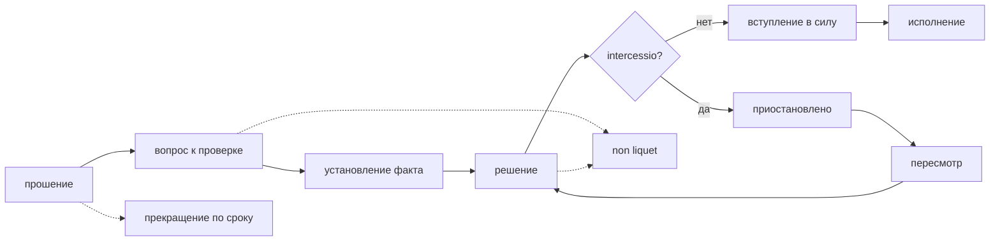

---
tags:
  - руководство
---

# 2. Мир и ход

## Период

Единица времени — **период**: условный сезон или год, в который укладывается
несколько дел и событий. Период выражается целым числом. Им датируется всё:
нормы, сроки должностей, факты, решения.

Период является тремя вещами сразу, и это не совпадение, а решение:

- единицей времени мира;
- циклом взаимодействия с игроком;
- единицей фиксации и повтора — прогон того же периода на тех же входах даёт
  тот же результат.

## Три фазы и стопка

Ход жёсткий: мир ждёт игрока, игрок ждёт мир, границы явные.

1. **Правка.** Игрок разбирает **стопку карточек**, пришедшую из прошлого
   периода. Каждая карточка — предложение правки закона: её повод — дело,
   замечание линтера, находка цензора или люди, задетые прошлой правкой, а
   текст предлагает советник-модель. Игрок принимает предложение, отклоняет его
   или пишет норму полностью сам. Здесь же он вбрасывает события мира —
   неурожай, войну, приток людей. Мира в этой фазе нет. Разобрав стопку, игрок
   запускает период.
2. **Проживание.** Полития разбирает дела пачкой: люди подают прошения,
   должности устанавливают факты, выносят и оспаривают решения. Игрока в этой
   фазе нет.
3. **Отчёт.** Что произошло, что нашёл линтер, кого задела правка закона. Из
   итога собирается следующая стопка.

Форма заимствована у Reigns — карточки приходят по одной и в разном порядке, —
но с одним существенным отличием: **карточка всегда про закон, а не про
конкретное дело**. Игрок никогда не решает, чем кончится дело; он решает, каким
будет закон, по которому дела кончатся.

Последствия своего закона игрок узнаёт только после проживания. Это и есть
основной источник напряжения: закон пишется вслепую, а счёт предъявляется
стопкой следующего периода.

В стороне от цикла стоит то, к чему обращается каждая фаза: единственный
ответчик на вопрос, какой нормативный результат применим к случаю в этом
периоде. Линтер спрашивает его до хода, дела — во время, отчёт — после. Ни одна
фаза не решает этот вопрос сама.

## Что происходит внутри проживания

Фаза проживания — это очередь дел, и каждое проходит один и тот же путь. Шаги
принадлежат **разным должностям**: тот, кто формулирует вопрос, не устанавливает
факт, а тот, кто решает, не исполняет.

Два пунктирных выхода важны не меньше сплошного. **Прекращение по сроку** — у
дела есть объявленный предел жизни в периодах, по истечении которого оно гаснет
само. **Non liquet**, «не ясно», — исход, при котором корпус не даёт по делу
определённого ответа; дело закрывается без результата, и это записывается.

Оба исхода не являются ошибками системы. Они являются наблюдаемыми следствиями
того, как игрок написал закон, и попадают в отчёт периода.

## Auctor

Игрок называется **auctor** — тот, кто порождает и уполномочивает. Он является
учредительной властью, находящейся **вне** политии: не человек, не занимает
должности, не может быть стороной дела и не вмешивается в конкретное дело.

Влиять на дела он может только через норму. Это ограничение не проверяется
отдельной проверкой — оно защищено структурой хода: в фазе проживания у auctor
просто нет хода, а в фазе правки каждая карточка меняет закон, а не дело.

Тонкость, которую стоит держать в голове: auctor не вмешивается в дела, но
через норму влияет на все дела сразу. Это принятая особенность, а не дыра.

Советник, предлагающий правку, — языковая модель. Её предложение становится
нормой только тогда, когда игрок его подтвердил, и до хода его проверяет
линтер. Модель советует; решает auctor.

## Люди

Человек — это идентичность, установленные о нём факты, занимаемые должности,
поданные прошения, желания и знание норм. Он хранится всю партию и переносим:
состоит из фактов и черт, а не из живого контекста модели. Желаемая
возможность — камео между партиями, как в Dwarf Fortress: герои завершённой
партии появляются в следующей.

Двух вещей в человеке **нет**: его прав и его обязанностей. Они не хранятся, а
выводятся из норм периода и установленных фактов. Из этого следуют две
приятные вещи: правка закона автоматически догоняет уже существующих людей, и
мигрировать при правке нечего.

Отдельно живут два разных рычага:

- **знание норм** — какие нормы попали в контекст человека. Это данные:
  детерминированно и воспроизводимо;
- **способность рассуждать** — насколько хорошо играющая человека модель
  обходится с тем, что увидела.

Разделение обязательно для чистоты диагноза. «Не знал, потому что норма не была
до него доведена» — провал законодателя, который система обязана показать.
«Знал, но перепутал» — не провал, а жизнь.

## Институты и должности

Институт состоит из должностей. **Компетенция принадлежит должности, а не
человеку**: человек получает её, заняв должность, и теряет, освободив. Без
этого конфликт интересов и узурпацию невозможно выразить структурно — они
превращаются в отсутствие данных.

У должности есть срок — период действия, как у нормы, — и объявленный способ
замещения: по конституции, выборностью, самопополнением органа. Система не
выбирает между способами; она требует, чтобы способ был указан, и проверяет,
что цепочка «кто назначает назначающего» нигде не висит и упирается в
учредительный акт. Дальше этой точки аппарат замещения абстрактен: он просто
есть, консенсусных протоколов в нём нет.

Самопополняющийся орган породит узурпацию сам. Это будет провал игрока, а не
механика движка, и это правильно.

## Что задаёт игрок, а что живёт в коде

Размер мира не фиксирован, и механики не хардкодят входящие величины.

**Данные сценария** — это пресет, стартовый мир партии; первый пресет — Древний
Рим. В нём: состав людей и их начальные факты; состав институтов, должностей,
их компетенции и сроки; уровни нормативной иерархии; сами нормы; статусы и
состав пучков прав; объём дел на период, бюджет вызовов модели, распределение
моделей по ролям; пороги проверок линтера. Пока пресет статичен: нормы меняются
в партии, но сам стартовый мир не редактируется.

**Механика в коде:** период и три фазы; датировка нормы периодом и определение
ретроактивности как `M < N`; принадлежность компетенции должности; вывод прав
вместо их хранения; сами алгоритмы проверок линтера; положение auctor вне
политии; состав записи журнала; обязательность вступления в силу перед
исполнением.

Одна вещь обязана быть данными и является самой дорогой частью входной модели:
**условие нормы**. Его выразительность определяет и то, что игрок способен
выразить, и то, что линтер способен проверить. Как оно устроено — следующая
глава.
