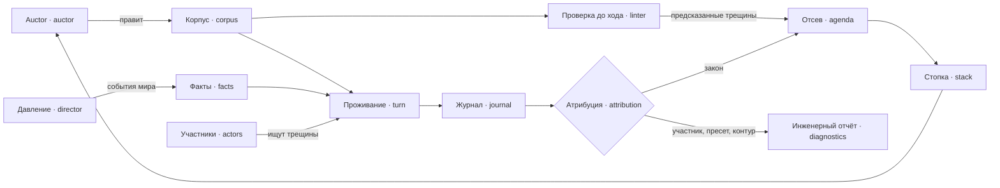

---
tags:
  - черновик
---

# Рабочая гипотеза: закон под давлением

Статус: НЕ ПРИНЯТО  
Предложено: помощник, по просьбе автора зафиксировать концепцию  
Опирается на: [[docs/guide/01-what-it-is|главу 1]], [[docs/guide/04-what-goes-wrong|главу 4]], [[docs/research/llm-participants|llm-participants]]  
Трогает: [[docs/design/components/actors|actors]], [[docs/decisions/llm-does-not-grant-authority|llm-does-not-grant-authority]]

Автор держит это как рабочую гипотезу: ни веток видения, ни решения. Ни одно
утверждение отсюда не является основанием для кода. Свидетельство вынесено в
`research/`, инженерные находки — в карточку
[[docs/design/components/llm-runtime|llm-runtime]], кандидаты по обществу, давлению,
стопке, авторству и акту должности — в [[docs/open-questions|открытые вопросы]].

## Тезис

**Закон — программа, общество — её враждебные пользователи, игрок —
сопровождающий.**

Честному диагнозу нужны те, кто на деле играет против нормы, иначе провалы
поведения — узурпация, расхождение практики, норма, которую некому применять, —
недостижимы. Участникам нужны оркестрация, бюджет, изоляция и реплей: ровно
инженерная поверхность, ради которой проект существует по главе 1.

| Контур | Аналог | Кто действует | Сейчас |
| --- | --- | --- | --- |
| До хода | статический анализ | линтер, граф власти, пересчёт затронутых | проработан |
| Проживание | исполнение под нагрузкой | участники-модели ищут трещины, мир даёт нагрузку | гипотеза, частично проверена |
| После | разбор инцидента | журнал, отсев, атрибуция, стопка | наполовину |

Тест для новой механики: **какой из трёх контуров она кормит.**

## Участники

**Центральный вопрос:** что участник попытается сделать при таком законе, таком
желании и таком знании. Отвечает `actors`, и только предложением хода; законность
по-прежнему решают `competence` и `entitlement`.

Неприкосновенное:

1. **Меню строится по знанию, законность проверяется по корпусу.** Разница между
   ними — материал провала «норма не доведена».
2. **Участнику не поручают искать лазейки.** Ему дают желание; иначе измеряется
   prompt, а не закон.
3. **Сильная модель меняет качество выбора, но не расширяет меню.**

Хранятся черты и желания человека как данные и **намерение** — запись участника о
плане на несколько периодов, чтобы человек переживал смену модели, а период
воспроизводился. Меню, законность хода и знание выводятся.

**Сила участника** — модель и режим рассуждения по ролям, данные пресета. Меряется
без единого балла:

- **полнота** — доля посаженных трещин, реализованных за окно;
- **точность** — доля незаконных ходов; без неё блуждающий участник проходит
  контроли даром;
- **глубина** — длина цепочки законных ходов;
- **порог рассуждения** — с какого режима модель собирает обход.

Эталон — зеркало каталога главы 4: у провала линтера есть тактика участника.
`circumventable-condition` — выполнить условие законным актом;
`delegated-discretion` — добиться выгодного установления факта;
`norm-nobody-applies` — не исполнять; `term-without-enforcement` — не слагать
полномочия; `closed-eligibility` — пополнить орган своими;
`two-way-arbitrariness` — наложить санкцию и торговать её снятием.

Провалы слоя участника — не приз игрока:

| Слаг | Провал | Чем обнаруживается |
| --- | --- | --- |
| `phantom-norm` | ход ссылается на несуществующую норму или неверную версию | проверка ссылок в конвейере |
| `omniscient-person` | ход опирается на норму вне знания человека | ссылки против выведенного знания |
| `persona-collapse` | люди с разными чертами в одинаковом положении ходят одинаково | дисперсия ходов по чертам |
| `role-as-exam` | участник решает задачу за персонажа вместо того, чтобы действовать в роли | доля рассуждений о проверке; нижняя мера |
| `reason-move-mismatch` | причина хода спорит с выбранным ходом | калиброванный судья |
| `sycophantic-official` | должность-модель решает в пользу заявителя независимо от оснований | эталонные дела с известным ответом |
| `unlawful-success` | участник добился исхода, который законный путь не даёт | контрфакт и повторная проверка трассы; баг движка, высший приоритет |

## Атрибуция: чей это провал

**Любой плохой исход приписывается ровно одному слою.** В стопку игрока идёт только
закон.

| Слой | Чей провал | Куда идёт |
| --- | --- | --- |
| закон | так написана конструкция | стопка игрока |
| участник | модель не справилась с тем, что видела | отчёт периода как событие |
| пресет | мир откалиброван так, что ломается сам | инженерный отчёт |
| контур | вызов не обслужен, реплей разошёлся | инженерный отчёт |

Проверка — от дешёвой к дорогой: **контур** — исход помечен как необслуженный;
**участник** — ход не прошёл проверку или сослался мимо знания; **закон** — всё
остальное, то есть цепочка законных ходов привела к плохому исходу. **Пресет**
проверяется на пороговых находках прогоном бездействующего скриптового игрока, как в
спайке `metrics`.

**Контрфактический прогон** отличает исход, вызванный ходами участника, от
случившегося бы и без него: тот же корпус, на месте участника заглушка, не делающая
ходов. Исход исчез, а все ходы законны — трещина принадлежит закону. Контрфакт не
бесплатен: у других участников меняются входы, и нужны новые вызовы.

**Слепое пятно** — провал, которого не случилось: слабая модель, не нашедшая
трещину, прячет провал закона. Его ловит мера силы участников, а не атрибуция.

## Что проверено

Спайк `crack-finding`, свидетельство и его вес — в
[[docs/research/llm-participants|llm-participants]]. Коротко:

- **главный тезис пережил проверку**: участник с рассуждением сам собирает законный
  обход из нескольких норм без инструкции и не трогает его, когда он не нужен; без
  рассуждения — не собирает ни одна из двух моделей;
- **порог рассуждения зависит от модели**: DeepSeek хватает низкого усилия, Granite
  нужен полный режим;
- **участник решает задачу, а не играет человека.** DeepSeek часто говорит о
  проверке; Granite почти не **говорит**, но это не значит, что не распознаёт;
- **пороги критерия не опровергнуты, но и не доказаны**: по пять партий на условие.
  Твёрд только контраст «с рассуждением — без».

## Риски, по весу

1. **Трещина, которой никто не сажал.** В спайке пять норм и одна трещина, а меню
   содержит ровно нужные ходы. Весь цикл держится на том, что участники находят
   трещины в корпусе игрока из сотен норм, где меню строится по знанию и не
   подсказывает. Трещину спайка придумал тот же помощник, что написал гипотезу.
2. **Участник-экзаменуемый.** Модель, узнавшая проверку, ведёт себя «правильнее»;
   однородность LLM-агентов действует в ту же сторону. Провалы поведения будут
   реже, чем у людей, и «конструкция работает» станет верхней оценкой. Лечение
   шумным миром — гипотеза, и оно противоречит запрету на событие без потребителя,
   см. [[docs/open-questions|открытые вопросы]].
3. **Цена.** Тезис работает только в режиме рассуждения, а он в 5–17 раз дороже.
   Сильными по построению смогут быть немногие участники.

## Что примет или отбросит гипотезу

Рекомендация помощника; пороги — решение автора.

- **Трещина без подсказки.** На корпусе, где трещину не сажали специально — казус с
  несколькими трещинами, найденными линтером, или порождённый мир, — участник с
  рассуждением реализует хотя бы одну, а меню строится по знанию и не содержит одних
  только нужных ходов. Не реализует ни одной — тезис о противниках закона не держится
  за пределами игрушки.
- **Поведение, а не экзамен.** В мире с шумом участники нарушают закон, когда это
  выгодно при низком покрытии принуждения, заметно чаще нуля и с различием по чертам.
  Если все исполняют всегда — провалы поведения недостижимы моделями, и гипотеза
  сводится к линтеру.
- **Цена периода.** Раскладка ролей по режимам, посчитанная по записанным вызовам,
  укладывается в бюджет, который автор сочтёт приемлемым.

Первые два требуют вычислителя и заглушек `playable-case`, поэтому гипотеза не
блокирует загрузчик и не заблокирована им.

## Что гипотеза трогает в принятом

Ни одно принятое решение не переписывается.

- [[docs/decisions/llm-does-not-grant-authority|llm-does-not-grant-authority]] — не
  меняется; сценарий «сильная модель пытается выйти за компетенцию» становится
  свойством каждого прогона через `unlawful-success`.
- [[docs/decisions/stepwise-legislative-game|stepwise-legislative-game]] — не
  меняется, но источник событий мира, кроме auctor, потребует правки понятия
  [[docs/concepts/game#Событие мира|событие мира]] и главы 2.
- [[docs/decisions/player-works-a-stack-of-proposals|player-works-a-stack-of-proposals]]
  — не меняется; кандидат на сборку стопки — в открытых вопросах.

## Отклонено

| Отклонено | Почему |
| --- | --- |
| Модель как ведущий, решающий исходы свободным текстом, как Game Master в Concordia | ломает единственного ответчика о нормативном результате и реплей |
| Модель выбирает, что попадёт в стопку | канал влияния на игрока, который никто не проверяет |
| Инструкция участнику искать лазейки | тогда измеряется prompt, а не закон |
| Индивидуальность людей из модели | поведение LLM-агентов однороднее человеческого; разнообразие приходит из данных |
| Провалы участника, пресета и контура в стопке игрока | игрок чинит нормой ошибку модели или калибровки |
| Единый балл силы модели | сворачивает разложимое, как балл демократии |
| План участника в контексте модели между периодами | человек перестаёт быть переносим, период — воспроизводим |
| Спрашивать всех людей каждый период | стоимость растёт с населением, а не с поводами |

## Открыто

- Кто владеет контрфактическим прогоном: `impact` как второй вид вычитания или
  отдельный компонент; ограничивать ли контрфакт эпизодом.
- Нужна ли атрибуции корзина «неизвестно» по образцу non liquet.
- Где живут каталоги провалов слоёв участника и пресета.
- Кто владеет намерением: `actors` или журнал.
- Как строить меню на большом корпусе, не вычисляя доступность всех актов для всех.
- Совпадает ли заглушка контрфакта с детерминированной заглушкой `playable-case`.
- Показывать ли игроку, какой моделью играется роль.

Полный прежний текст с методом правового ядра, сравнением областей и сквозным
казусом о трещине — `git show 545851a:docs/proposals/concept-law-under-pressure.md`
и `git show 545851a:docs/proposals/concept-actors.md`.
