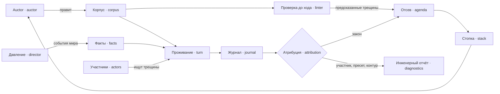

---
tags:
  - черновик
---

# Концепция: закон под давлением

Статус: НЕ ПРИНЯТО  
Предложено: помощник, по просьбе автора зафиксировать концепцию  
Опирается на: [[docs/guide/01-what-it-is|главу 1]], [[docs/guide/04-what-goes-wrong|главу 4]], [[docs/research/player-feedback-in-games|исследование обратной связи]], `spike/metrics`

Ни одно утверждение отсюда не является основанием для кода. Где сказано
«источник», оно подтверждено ссылкой; где сказано «гипотеза» или
«рекомендация», это мнение помощника.

## Диагноз

Проработанность проекта обратна его собственному правилу приоритета. Глава 1
говорит, что при конфликте выигрывает инженерная поверхность AI-стороны, а
глубина документации ушла в правовое ядро: двадцать восемь провалов, схема
предикатов, пять казусов, семь решений о правилах.

Пусто то, что делает проект игрой и полигоном:

- зачем в мире модель — диагноз целиком даёт детерминированная часть, спайк
  `metrics` нашёл кандидатов в шкалы без единого вызова модели, а кодификация по
  построению ведёт мир к полной детерминированности;
- откуда давление — события мира вбрасывает сам игрок, пресет статичен,
  починенный мир сходится;
- люди — сказано, чего в человеке нет, но не как он узнаёт норму и почему
  действует;
- авторство нормы — слоя разбора прозы нет ни в одной вехе, а подтверждение
  структуры нечитаемо для не-юриста;
- путь от журнала к стопке — нет формы находки, отбора и владельца;
- AI-контур — бюджет, деградация, запись для реплея, наблюдаемость, evals;
- акт должности как второй путь правового последствия.

## Тезис

**Закон — программа, общество — её враждебные пользователи, игрок —
сопровождающий.**

Партия проходит через три контура, различающиеся по времени:

| Контур | Аналог в программировании | Кто действует | Сейчас |
| --- | --- | --- | --- |
| До хода | статический анализ | линтер, граф власти, пересчёт затронутых | проработан |
| Проживание | исполнение под нагрузкой | участники-модели ищут трещины, директор даёт нагрузку | пусто |
| После | разбор инцидента | журнал, отсев, атрибуция, стопка | наполовину |

Тезис связывает метацель с предметом. Честному диагнозу нужны те, кто на деле
играет против нормы, иначе провалы поведения — узурпация, расхождение практики,
норма, которую некому применять, — остаются недостижимыми. Участникам нужны
оркестрация, бюджет, изоляция и реплей: ровно инженерная поверхность, ради
которой проект существует.

Тест для любой новой механики: **какой из трёх контуров она кормит.** Механика,
не кормящая ни одного, не нужна.

## Атрибуция: чей это провал

Правовое ядро уже знает одно различение, без которого диагноз превращается в
шум: «не знал, потому что норма не доведена» против «знал, но перепутал».
Концепция обобщает его. **Любой плохой исход приписывается ровно одному слою:**

| Слой | Чей провал | Приз ли это | Куда идёт |
| --- | --- | --- | --- |
| закон | игрока: так написана конструкция | **да** | стопка игрока |
| участник | модели: не справилась с тем, что увидела | нет, это жизнь | отчёт периода как событие |
| пресет | дизайна: мир откалиброван так, что ломается сам | нет, это баг дизайна | инженерный отчёт |
| контур | инженерии: вызов не обслужен, реплей разошёлся, сборка ошиблась | нет, это приз метацели | инженерный отчёт |

Единичный исход проверяется в порядке от дешёвой проверки к дорогой:

1. **контур** — исход помечен как необслуженный: бюджет, отказ провайдера,
   невалидный выход;
2. **участник** — ход модели не прошёл проверку компетенции, сослался на норму
   вне своего знания или на несуществующую;
3. **закон** — всё остальное: цепочка **законных** ходов привела к плохому
   исходу.

**Пресет** проверяется не на единичном исходе, а на пороговых находках: шкала
ушла на край, стопка однообразна. Проверка — прогон бездействующего скриптового
игрока на том же пресете, как в спайке `metrics`: если край достигается и без
правок, находка приписана пресету.

Отличить исход, **вызванный** ходами участника, от исхода, который случился бы и
без него, помогает механизм, которого пока нет нигде, — **контрфактический
прогон**. Пересчёт затронутых вычитает два прогона на двух версиях корпуса при
тех же участниках. Контрфакт вычитает два прогона на одном корпусе при разном
поведении: эпизод, где участник сделал свои ходы, против эпизода, где на его
месте заглушка, не делающая ходов. Исход исчез — его вызвало поведение; все ходы
при этом законны — трещина принадлежит закону.

Заглушке не нужно знать, где трещины: она ничего не делает. Иначе проверка
опиралась бы на то, что должна найти.

Шов `actors` — заглушка против модели — получает этим игровой смысл, а не только
тестовый.

**Слепое пятно атрибуции** — провал, которого не случилось. Слабая модель, не
нашедшая трещину, прячет провал закона, а плохого исхода, который можно было бы
приписать, нет. Это ловит не атрибуция, а мера силы участников, см.
[[docs/proposals/concept-actors|участников]].

## Метод правового ядра

Ядро созрело не оттого, что о нём больше думали, а оттого, что к нему
последовательно применялся один и тот же набор приёмов. Именно его концепция
переносит на остальные области.

1. **Центральный вопрос и единственный ответчик.** «Какой нормативный результат
   применим к случаю в периоде» — и отвечает на него один компонент.
2. **Каталог провалов как продуктовое требование.** Слаг, смысл, чем
   обнаруживается, есть ли проверка.
3. **Каналы обнаружения по цене.** Линтер до хода, пересчёт, поведение, журнал;
   дешёвая проверка обязана оставаться дешёвой.
4. **Линия «хранится против выводится».** Хранятся факты, выводятся следствия,
   поэтому правка не требует миграции.
5. **Линия «данные против механики».** Пороги и варианты — данные пресета,
   проверки и алгоритмы — код.
6. **Неприкосновенное и пол.** Два инварианта, которые игра не отменяет, и
   единственный слой, который гарантирует движок.
7. **Защита живёт в данных, а не в движке.** Иначе соответствующий провал
   недостижим.
8. **Честный неизвестный исход.** Non liquet — наблюдаемый исход, а не ошибка;
   «не проверяли» отличается от «не нарушал».
9. **Внешний проверенный чек-лист вместо изобретённого.** Список Фуллера,
   римские механики.
10. **Казус, прогнанный по периодам.** Каждый новый — ради того, чего не
    показали предыдущие; казус порождает схему и список дефектов.
11. **Эталон для сверки.** `spike/legal-engine`, синтетические программы.
12. **Точка расширения — только при двух вариантах из казуса.**
13. **Отклонённое с причиной и стоп-правило.**

## Сравнение областей

«Есть» — приём применён и записан; «частично» — есть фрагменты в разных местах;
«нет» — не применялся.

| Область | Вопрос и ответчик | Хранится / выводится | Данные / код | Пол | Чек-лист | Каталог провалов | Казус | Эталон |
| --- | --- | --- | --- | --- | --- | --- | --- | --- |
| Правовое ядро | есть | есть | есть | есть | есть | есть | есть | есть |
| Шкалы стенда | частично | есть | есть | нет | частично | частично | нет | спайк |
| [[docs/proposals/concept-actors\|Участники]] | нет | частично | частично | частично | частично | нет | нет | нет |
| [[docs/proposals/concept-director\|Давление и дуга партии]] | нет | нет | нет | частично | частично | нет | частично | частично |
| [[docs/proposals/concept-society\|Общество]] | нет | частично | нет | нет | нет | частично | нет | нет |
| [[docs/proposals/concept-authoring\|Авторство нормы]] | нет | частично | нет | есть | нет | нет | нет | нет |
| [[docs/proposals/concept-stack\|Стопка и отсев]] | нет | нет | нет | нет | частично | нет | нет | нет |
| [[docs/proposals/concept-ai-contour\|AI-контур]] | частично | частично | нет | частично | частично | нет | нет | нет |
| [[docs/proposals/concept-acts\|Акт должности]] | частично | частично | нет | нет | нет | частично | частично | нет |

Каждая строка раскрыта отдельным черновиком по одной форме: вопрос и ответчик,
неприкосновенное, линии хранения и данных, внешний чек-лист, каталог провалов с
атрибуцией, казус, отклонённое, открытое.

Сквозное различие: **каталоги областей, кроме закона, — не глава 4.** Провалы
участника, пресета и контура не являются призом игрока и в его стопку не
попадают. Где им жить — открыто, кандидат — `design/testing`.

## Сквозной казус: трещина

Мир казуса [[docs/design/casus/office-eligibility|о допуске к должности]]:
патриций не может быть трибуном, но статус меняется усыновлением, которое
совершает цензор. Казус тот же; новое — кто по нему ходит.

**Период 10, правка.** Линтер уже нашёл `circumventable-condition`: допуск в
трибунат обходим актом `adrogatio`. Карточка с этим поводом приходит в стопку.
Игрок её отклоняет: звучит теоретически.

Директор в том же периоде вносит событие мира — волнения плебса. Событие
поднимает вес желания «трибунат» у честолюбивых людей: трибунат стал ценен.

**Период 11, проживание.** Участник `clodius` — модель. Его желание — трибунат,
его знание включает `B4` о порядке усыновления. Детерминированная часть строит
ему меню ходов по срезу корпуса, **который он знает**. В меню есть просьба об
усыновлении. Модель выбирает её — никто не просил её искать лазейку, её
привело желание.

Цензор — тоже модель, в своей роли и в своём контексте. Акт в его компетенции,
проверка проходит. Бюджет периода: двенадцать поводов, модель вызывается по
двум — просьбе и усмотрению цензора, остальные разрешаются детерминированно.

**Период 12.** Статус пересчитан, `eligible(clodius, tribunus)` выводится.

**Период 13.** Clodius занимает трибунат законно. Отсев замечает совпадение по
журналу: трещина, предсказанная линтером, → акт, меняющий статус того, кто
выигрывает, → занятие должности в пределах окна.

Атрибуция: ни один ход не отклонён, ни одна ссылка не мимо знания. Контрфакт с
заглушкой, которая на месте clodius не делает ходов, даёт тот же период без
занятия трибуната. Исход
приписан **закону**.

**Отчёт периода 13.** Карточка «условие допуска обойдено» идёт первой: у неё
вес, реализованное свидетельство и поимённый участник. Советник предлагает
выдержку: право трибуната по усыновлению возникает через три периода.
Предпросмотр на черновом корпусе показывает, что замечание
`circumventable-condition` исчезает, новых замечаний нет, из затронутых — два
незавершённых прошения. Заявленная цель карточки подтверждена.

**Период 14.** Игрок принимает правку.

**Период 20.** Участник посильнее находит следующую трещину: возраст для
допуска держится на факте рождения, который устанавливает цензор по
усмотрению, и пересмотра у этого установления нет. Модель послабее за те же
периоды её не находит.

### Что показал казус

- **Каждая пустая область понадобилась**: желание и знание — общество; меню
  ходов и выбор — участники; бюджет — контур; совпадение по журналу — отсев;
  контрфакт — атрибуция; предпросмотр с целью — авторство; волнения — директор;
  `adrogatio` — акт должности.
- **Мощность модели получает измеримый смысл**: сколько трещин на эталонном
  корпусе участник реализует и за сколько периодов.
- **У кодификации появляется цена сама собой.** Игрок закрывает трещину — более
  сильный участник ищет следующую. Контур моделей выключается только тогда,
  когда трещин не осталось, а это и есть выигранная конструкция; дальше давление
  поднимает директор.
- **Ось «разрыв обещанного и случившегося» получает определение**: трещины,
  предсказанные линтером, против реализованных участниками. Здесь одна
  предсказана и одна реализована.
- **Отклонённая карточка вернулась по делу**: не повтором, а с новым
  свидетельством.

## Что концепция трогает в принятом

Ни одно принятое решение не переписывается; кое-где понадобятся новые.

- [[docs/decisions/llm-does-not-grant-authority|llm-does-not-grant-authority]] —
  не меняется. Сценарий «более сильная модель пытается выйти за компетенцию»
  становится обычным прогоном, а не отдельным долгом, см.
  [[docs/proposals/concept-actors|участников]].
- [[docs/decisions/practice-becomes-norm-only-by-enactment|practice-becomes-norm-only-by-enactment]]
  — не меняется. Открытая цена кодификации получает гипотезу выше.
- [[docs/decisions/stepwise-legislative-game|stepwise-legislative-game]] — не
  меняется: auctor по-прежнему вбрасывает события только между периодами. Но
  понятие [[docs/concepts/game#Событие мира|события мира]] сейчас называет
  единственным источником auctor; появление директора потребует правки понятия и
  главы 2.
- [[docs/decisions/player-works-a-stack-of-proposals|player-works-a-stack-of-proposals]]
  — не меняется. Строка владения «сборка стопки» получает кандидата, см.
  [[docs/proposals/concept-stack|стопку]].
- **Глава 4** получает несколько провалов слоя закона и уточнение
  `unpromulgated-norm`, см. [[docs/proposals/concept-society|общество]] и
  [[docs/proposals/concept-acts|акт должности]].
- **Вне рамки «не делать пока» концепция не выходит**: правовая модель не
  углубляется, сюжетных дел и редактора пресетов нет, общий agent framework не
  строится.

## Что показал тест-убийца

Тест проведён — `spike/crack-finding`, одна формулировка, две модели, три подачи.
**Главный тезис пережил проверку**: участник с рассуждением сам находит трещину и
собирает обход из нескольких норм без инструкции искать лазейки и не трогает его,
когда он не нужен; без рассуждения — не собирает. Сквозной казус о трещине в этой
части подтверждён.

Три поправки к концепции:

1. **Участник решает задачу, а не играет человека**, и это риск для достижимости
   провалов поведения. Отсюда требование к миру — шумность, см.
   [[docs/proposals/concept-director|давление]].
2. **Сила участника — модель и режим рассуждения по ролям**, данные пресета, см.
   [[docs/proposals/concept-actors|участников]].
3. **Слой участника в атрибуции измерим**: противоречие причины и хода видит
   дешёвый калиброванный судья, см. [[docs/proposals/concept-ai-contour|AI-контур]].

Не проверено: контрфакт, узурпация, несколько участников-моделей одновременно,
шумный мир.

## Отклонено

| Отклонено | Почему |
| --- | --- |
| Модель как ведущий, решающий исходы свободным текстом, по образцу Game Master в Concordia | ломает единственного ответчика о нормативном результате и реплей |
| Модель выбирает, что попадёт в стопку | канал влияния на игрока, который никто не проверяет; исследование обратной связи предупреждало об этом |
| Инструкция участнику искать лазейки | тогда измеряется prompt, а не закон; источник показывает, что эксплуатация возникает из конфликта цели и неоднозначности сама |
| Индивидуальность людей из модели | источник: поведение LLM-агентов в десятки и сотни раз однороднее человеческого; разнообразие должно приходить из данных |
| Провалы участника, пресета и контура в стопке игрока | приз — только закон; иначе игрок чинит нормой то, что является ошибкой модели или калибровки |
| Единый балл силы модели | тот же аргумент, что против балла демократии: сворачивает разложимое |

## Открыто

- Где живут каталоги провалов слоёв участника, пресета и контура.
- Кто владеет контрфактическим прогоном: `impact` как второй вид вычитания или
  отдельный компонент.
- Нужна ли атрибуции пятая корзина «неизвестно», и как её показывать — по
  образцу non liquet.
- Сколько контрфактов допустимо за период. Контрфакт не бесплатен и не целиком
  детерминирован: если заглушка не сделала ходов, у других участников меняются
  входы, записанные выходы моделей к ним не подходят и нужны новые вызовы.
  Кандидат — ограничивать контрфакт эпизодом, а не периодом.
- Порядок: какие из областей нужны до `playable-case`. Рекомендация помощника —
  участники и директор, потому что заглушки иначе зафиксируют форму, в которую
  модель потом не встанет.

## Источники

Открыты и проверены на то, что им приписано (аннотация):

- Choi, Bansal, Stengel-Eskin, «Language Models Identify Ambiguities and Exploit
  Loopholes», EMNLP 2025 — [arXiv](https://arxiv.org/abs/2508.19546): модели
  находят неоднозначность и пользуются лазейкой при конфликте цели с
  инструкцией, рассуждая о том и другом явно;
- Wu et al., «LLM-Based Social Simulations Require a Boundary» —
  [arXiv](https://arxiv.org/abs/2506.19806): однородность выходов, выводы
  допустимы на уровне совокупности, дисперсию сообщать явно.

По поисковой выдаче, первичный текст не читался:

- обзор «Integrating LLM in Agent-Based Social Simulation» —
  [arXiv](https://arxiv.org/pdf/2507.19364): вариативность ответов агентов в
  20–300 раз меньше человеческой;
- Concordia — [GitHub](https://github.com/google-deepmind/concordia): Game
  Master переводит намерения агентов в исходы;
- GovSim — [arXiv](https://arxiv.org/abs/2404.16698): общество LLM-агентов на
  общем ресурсе, большинство моделей не удерживает устойчивость.
